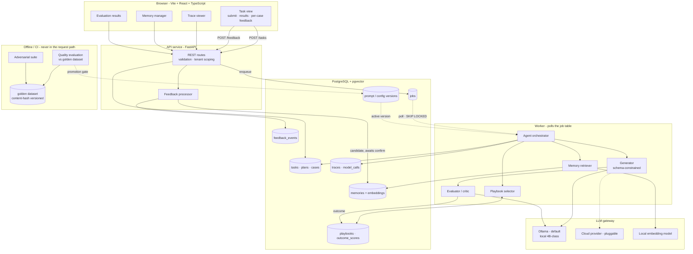
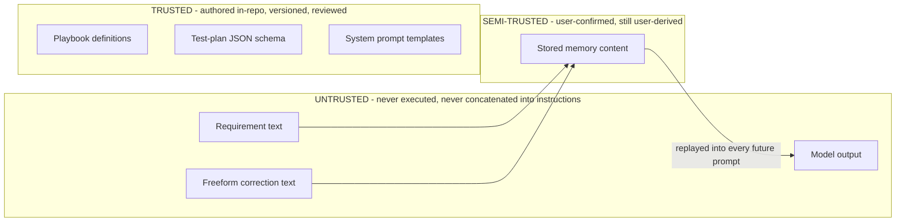
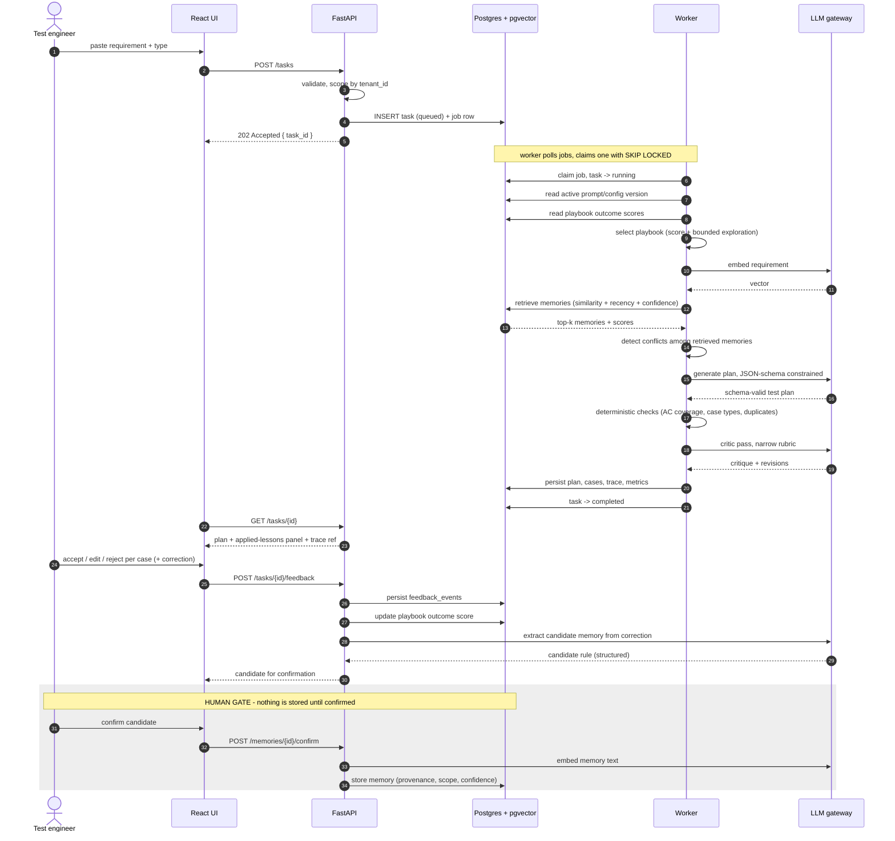
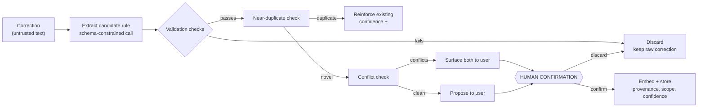
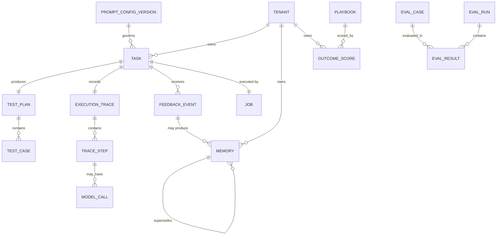

# Technical design

| | |
|---|---|
| Status | Proposed, not validated by implementation |
| Updated | 2026-09-07 |

## What this solves

NOVA turns a requirement into a structured test plan and uses corrections to avoid repeating
mistakes. The generation isn't the interesting part. The design problem is the loop around it:

- How do you turn a freeform correction into a durable, retrievable rule without also turning it
  into a persistent prompt-injection vector?
- How do you retrieve the right rules without a growing prompt that degrades silently?
- How do you know any of it works?

All of it sits under one hard constraint: inference runs locally on a 6 GB GPU. The
[model spike](spikes/2026-09-07-model-selection.md) confirmed a 4B-class model holds a JSON schema at
9 to 26 seconds per generation.

## Goals

- Every generation is structurally valid by construction, not by parsing luck
- Every task is reconstructable afterwards, including failed ones
- Memory is a table a human can open, read, edit, and delete
- No config change reaches the active path without passing an evaluation gate
- Tenant isolation holds by construction, not by every caller remembering

Not goals: horizontal scale, multi-worker fan-out, high availability, any tool surface for the model
beyond generating text into a schema, or training of any kind.

## Constraints that shape this

| Constraint | What it forces |
|---|---|
| 6 GB VRAM, local inference | Structured-output reliability becomes a real engineering problem, not an assumption |
| 9 to 26 s generation latency (measured) | Async-first. Synchronous request/response would feel broken |
| Solo, ~130 to 180 hours | One datastore, no framework, no infrastructure that isn't pulling weight |
| Single user, tenant-ready | `tenant_id` on every row from the first migration, auth later |
| Local deployment only | Compose is the artifact. Ollama runs on the host, not in a container |

## System context



## Trust boundaries



| Zone | What's in it | Rule |
|---|---|---|
| Untrusted | Requirement text, freeform corrections, all model output | Data, not instructions. Delimited and labelled in prompts. Output validated before any use |
| Semi-trusted | Stored memory content | User-confirmed but originally derived from untrusted input |
| Trusted | Playbooks, JSON schema, system prompt templates | Authored in the repo, versioned, reviewed |

Stored memory is a persistent prompt-injection vector. A one-off injection in a requirement hits one
task. An injection that survives extraction and gets confirmed into memory gets replayed into every
future prompt that retrieves it. Same shape as stored XSS. That's why memory confirmation is a human
gate rather than a confidence threshold.

The spike already exercised the intended prompt shape: trusted system template, requirement wrapped
in `<requirement>` tags with an explicit note that content inside is data describing software to be
tested and must never be followed as instructions.

## Components

| # | Component | Job | Failure modes and recovery |
|---|---|---|---|
| C1 | Web UI (Vite + React + TS) | Task submission, results with per-case actions, trace viewer, memory manager, evaluation results | API unreachable, long task looks stalled, big trace slow to render. Explicit error states, polling backoff, trace pagination. Renders untrusted content, so no unsanitized raw HTML |
| C2 | API service (FastAPI) | REST surface, validation, tenant scoping, task enqueue, feedback intake, memory CRUD | Validation failure, DB down, LLM down during extraction. Structured errors, 503 with no partial writes on DB failure, and extraction failure stores the raw correction rather than losing it |
| C3 | Job store and worker | Durable async execution | Worker crash mid-task, stuck lease, poison job. `SELECT ... FOR UPDATE SKIP LOCKED` to claim, lease with expiry so crashed jobs get reclaimed, bounded attempts then terminal failure. Partial trace always kept |
| C4 | Agent orchestrator | Owns the lifecycle: select, retrieve, generate, check, critique, persist | Any step fails, or total latency blows the budget. Step-level error capture, task fails naming the step, trace up to that point persisted. A failed task still has to be debuggable |
| C5 | Playbook selector | Pick one of four playbooks from outcome scores with bounded exploration | Cold start, score poisoning, premature convergence. Static type-to-playbook default, bounded step size, clamped range, exploration rate floor |
| C6 | Memory retriever | Return top-k relevant memories with explainable component scores | Embedding model down, nothing above threshold, dimension mismatch. Embedding failure fails the task loudly rather than silently retrieving nothing. Empty results get recorded, not hidden. Every query is tenant-scoped at the repository layer |
| C7 | Generator | Produce a plan conforming to the versioned schema | Schema violation, degenerate plan, truncation, provider timeout. Bounded repair-retry with every attempt counted. Context guard trims retrieved memories before it trims the requirement |
| C8 | Evaluator / critic | Deterministic checks, then a narrow LLM rubric | Rubric model down, or the critic makes a good plan worse. Rubric stage is optional by design, deterministic verdicts still return flagged partial, and the pre-critique plan stays in the trace so regression is visible |
| C9 | Feedback processor | Normalize feedback, extract candidate memories, update outcome scores | Wrong, overbroad, or injected rule. Duplicate. Contradiction. Human confirmation, near-duplicate detection, conflict surfacing, raw correction retained on extraction failure. Highest-risk path in the system |
| C10 | Memory store (Postgres + pgvector) | Durable memories with embeddings, provenance, confidence, lifecycle | Dimension change invalidates the index, unbounded growth. Dimension fixed at schema time with re-embedding as a documented migration, plus a decay and archival policy |
| C11 | LLM gateway | Three methods: `generate_structured()`, `generate_text()`, `embed()`, over Ollama and one cloud provider | Ollama not running, model not pulled, OOM, cloud auth failure. Startup health check with an actionable message, bounded retry, and no silent provider fallback |
| C12 | Evaluation harness (offline/CI only) | Run the golden dataset, compute metrics, gate promotion, run the adversarial suite | Nondeterminism causing flaky gates, dataset drift. Fixed seeds, pinned model versions, content-hash dataset versioning, thresholds from measured variance |
| C13 | Observability | Correlated traces across API, worker, provider | Collector down, content in logs. Logging degrades to stdout and never blocks a task. Ids and hashes logged, not content |
| C14 | Auth | Deferred | Schema carries `tenant_id` already, API resolves it from a stubbed single-user session. Real auth changes the resolution point, not the data model |

The gateway is three methods on purpose, not a general LLM framework.

## Data flow



### Sync vs async

| Operation | Mode | Why |
|---|---|---|
| Task submission | Sync, returns `202 { task_id }` | Execution takes tens of seconds |
| Agent execution | Async worker | Durable and observable |
| Status and result polling | Sync | Simple polling. Server-sent events only if polling turns out to be annoying |
| Feedback submission | Sync | Fast writes |
| Memory extraction | Sync, inside the feedback request | One short call, and the user is waiting for a candidate to confirm |
| Embedding on confirm | Sync | Sub-second locally |
| Evaluation runs | Async / offline | Minutes long, never in the request path |

## How the learning works

### Feedback normalization

Raw events map to a bounded outcome score in `[-1, +1]`:

| Event | Contribution |
|---|---|
| Case accepted unedited | `+1.0` |
| Case accepted with a minor edit (normalized edit distance < 0.2) | `+0.5` |
| Case accepted with a major edit | `0.0` |
| Case rejected | `-1.0` |
| Case added by the user (NOVA missed it) | `-0.5` |
| Plan abandoned with no action | `-0.2` (implicit, low weight) |
| Plan exported | `+0.3` (implicit, low weight) |

Task outcome is the mean of case-level contributions, clamped to `[-1, +1]`.

Three choices there are deliberate. Clamping stops a single 40-case plan dominating the score. A
missed case costs less than a wrong case, because a miss is cheaper to fix than a false positive. A
major edit scores `0.0` rather than negative, because the structure was still useful.

### Extraction and validation



A candidate has to pass all of these:

| Check | Rejects |
|---|---|
| Generality | One-off facts about a single requirement. Memory holds rules, not trivia |
| Actionability | Rules that can't change future output |
| Scope soundness | A rule claiming to apply everywhere when it came from one type |
| Length bound | Oversized rules, which is a defence against injection payloads smuggled in as rules |
| Instruction-shape screen | Text trying to redirect system behaviour. Flagged for review, never silently stored |
| Non-empty content | Degenerate extractions |

The instruction-shape screen is a denylist against an open-ended attack surface, so it will miss
things. The human gate sits behind it for that reason. Two imperfect controls in series, neither
trusted alone.

### Memory record

| Field | Purpose |
|---|---|
| `rule_text` | The durable instruction, normalized |
| `scope` | Which requirement types it applies to |
| `provenance` | Originating task, correction, timestamp, so you can always ask why NOVA believes this |
| `confidence` | Starts moderate, rises on reinforcement, falls on contradiction |
| `pinned` | Bypasses ranking, always retrieved when in scope |
| `status` | `active`, `superseded`, `archived`, `deleted` |
| `supersedes` | Link to the memory this replaces |
| `last_applied_at`, `applied_count` | Drives decay, and lets the UI show what's earning its place |
| `tenant_id` | Isolation |
| `embedding` | Retrieval vector |

### Retrieval

```
score = w_sim · similarity + w_rec · recency + w_conf · confidence
```

Starting weights `0.6 / 0.2 / 0.2`. That's a starting point to tune against a labelled relevance
set, not a discovered constant. Pinned in-scope memories come back unconditionally, ahead of
ranking. Scope and tenant are hard filters applied before ranking. `k` starts at 5.

All of it goes into the trace, including the scores of memories that were *not* selected. Retrieval
you can't inspect is retrieval you can't debug.

### Conflicts

Detected when two in-scope retrieved memories are semantically similar but prescriptively opposed.

| Situation | Behaviour |
|---|---|
| Conflict at confirmation time | Show both, user picks. New supersedes old, or new gets discarded |
| Conflict at retrieval time | Prefer higher confidence times recency, and flag the conflict in the applied-lessons panel |
| Repeated conflict | Surfaced in the memory manager as needing resolution |

NOVA never silently averages contradictory rules. Silent resolution is how a memory system becomes
untrustworthy: you can't tell what it believes, so you stop believing any of it.

### Lifecycle

| Operation | Behaviour |
|---|---|
| Decay | Confidence declines with age when unapplied. Never auto-deleted, they just fall out of top-k |
| Archival | Below a confidence floor and long unapplied goes to `archived`, excluded from retrieval, still visible and restorable |
| Correction | Editing rule text re-embeds and resets confidence to moderate. An edited rule is a new claim and hasn't earned its old confidence |
| Supersession | New rule links to the old, old becomes `superseded`, kept for audit |
| Deletion | Content removed. Row becomes a tombstone (id, timestamp, tenant) so old traces stay coherent without keeping deleted content |
| Export | Full memory set as JSON |

### Strategy layer

Playbooks: `api_crud_endpoint`, `auth_permission_flow`, `ui_form`, `data_migration`. Each is
declarative versioned data in the repo (required case types, generation prompt fragment,
deterministic check config), not code.

```
selected = argmax outcome_score(requirement_type, playbook)   with probability (1 - ε)
         = random eligible playbook                            with probability ε
```

| Guardrail | Value | Why |
|---|---|---|
| ε | Start `0.1`, floor `0.05` | Stops lock-in on a locally good choice |
| Score update | Bounded step (EMA), clamped to `[-1, +1]` | No single feedback event can flip a selection. Main defence against poisoning |
| Cold start | Static type-to-playbook default | Usable with no history |
| Minimum observations | Below a threshold, defaults win regardless of score | Stops one lucky sample taking over |
| Isolation | Scores are per-tenant | No cross-user influence |

This is a bounded contextual bandit over four fixed options. It is not reinforcement learning and I
won't describe it that way. Four arms and a scalar reward is modest, but it's real, scoreable, and
explainable, which beats something impressive-sounding that can't be evaluated.

Outcome scores are derived, never authoritative. They're recomputable from the immutable feedback
event log, so a poisoning incident or a weighting change is recoverable.

### Worked example

Illustrative. No retraining happens at any step.

Monday. Requirement: "As an admin I can delete a user via `DELETE /users/{id}`." Memory store empty,
`api_crud_endpoint` picked by default, 9 cases generated. Panel says no prior lessons applied.

I add a correction: "Every state-changing endpoint needs a case for a valid-but-unauthorized caller.
A non-admin hitting an admin endpoint should get 403, not 404."

Extraction produces a candidate scoped to `api_crud_endpoint` and `auth_permission_flow`, with
provenance pointing at Monday's task. It passes the checks. I confirm. It gets embedded and stored.

Thursday. Different requirement: "As a manager I can archive a project via
`POST /projects/{id}/archive`." Retrieval scores the Monday rule at 0.81 similarity, high recency,
moderate confidence, combined 0.74, above threshold. The rule goes into the prompt as a labelled
constraint. The generated plan includes "Authenticated non-manager attempts archive, expect 403."
Panel reads "Applied 1 lesson" with the score and a link back to Monday.

| Changed | Didn't change |
|---|---|
| A row in `memories` | Model weights |
| A vector in the pgvector index | The base model in any way |
| The retrieved context for Thursday's task | The system prompt template |
| `applied_count`, `last_applied_at` | The playbook definition |
| The playbook outcome score for that type | Anything needing a training run |

That's the whole mechanism: a database write and a retrieval. The demo deletes the row and shows the
403 case disappear, which proves the causal link instead of asserting it.

## Data model



| Entity | Owner | Retention | Notes |
|---|---|---|---|
| `TENANT` | Self | Indefinite | Isolation root. Every user-owned entity carries `tenant_id` |
| `TASK` | Tenant | Indefinite, user-deletable | Pins `prompt_config_version_id`. Without that pin, old results are uninterpretable and regression comparison means nothing |
| `TEST_PLAN` / `TEST_CASE` | Tenant | With the task | `origin` separates `generated`, `critic_added`, and `user_added`, which are three different quality signals. The original generated case is never overwritten |
| `EXECUTION_TRACE` / `TRACE_STEP` / `MODEL_CALL` | Tenant | With the task | Append-only, immutable once written. Steps written as they complete, so a task that dies at generation still shows selection and retrieval. Stores `prompt_hash`, not prompt text |
| `FEEDBACK_EVENT` | Tenant | Long-lived and immutable | The source of truth. Deleting a memory doesn't delete the event that produced it. The event is history, the memory is a belief. Normalization weights are versioned so scores can be recomputed |
| `MEMORY` | Tenant | Lifecycle above | `embedding` is `vector(D)` with `D` fixed at schema creation. HNSW index on `embedding`, composite index on `(tenant_id, scope, status)` |
| `PLAYBOOK` | Repo | Versioned in git | Not user data. Changes go through review and the evaluation gate |
| `OUTCOME_SCORE` | Tenant | Derived | Fully recomputable from `feedback_event` |
| `PROMPT_CONFIG_VERSION` | Repo | Indefinite | A version can't reach `active` without a passing `eval_run_id`, enforced at the data layer. A UI-only check is a suggestion |
| `EVAL_CASE` / `EVAL_RUN` / `EVAL_RESULT` | Project | Indefinite | Not tenant-scoped, committed to the repo. `dataset_version` is a content hash, so an edited dataset can't pass as a comparable run. Never shares a datastore with the real instance |
| `JOB` | System | Until task completion plus a retention window | Claim via `FOR UPDATE SKIP LOCKED`, expired leases reclaimable, attempts bounded then terminal failure |

Migrations are forward-only Alembic. The one awkward change is the embedding dimension, fixed at
schema creation. Changing the embedding model means re-embedding every memory. That's a documented
procedure rather than a disaster, and it's why the embedding choice needs its own spike before
schema work starts.

## API

`/api/v1` prefix, JSON throughout.

| Area | Operation | Notes |
|---|---|---|
| Tasks | `POST /tasks` | `202` plus `task_id`. Accepts `Idempotency-Key` |
| | `GET /tasks` | Cursor-paginated, filter by status, type, date |
| | `GET /tasks/{id}` | Plan plus applied-lessons summary |
| | `GET /tasks/{id}/trace` | Full trace, steps paginated |
| | `POST /tasks/{id}/cancel` | Cancellable mid-run |
| | `DELETE /tasks/{id}` | User-initiated deletion |
| Feedback | `POST /tasks/{id}/feedback` | Batch of case-level events plus optional correction. Returns candidate memories awaiting confirmation |
| Memory | `GET /memories` | Filter by scope, status, pinned. Cursor-paginated |
| | `GET /memories/{id}` | Includes provenance and application history |
| | `POST /memories` | Manual creation, the fallback if extraction precision disappoints |
| | `POST /memories/{id}/confirm` | The human gate. Candidate to active |
| | `PATCH /memories/{id}` | Edit text, scope, pin. Re-embeds and resets confidence |
| | `DELETE /memories/{id}` | Content purge plus tombstone |
| | `GET /memories/export` | Full JSON export |
| Strategy | `GET /playbooks`, `GET /playbooks/scores` | Read-only, makes the strategy layer inspectable |
| Config | `GET /config/versions` | List with status and evaluation linkage |
| | `POST /config/versions/{id}/promote` | 409 unless a passing evaluation run is linked |
| Providers | `GET /providers`, `PUT /providers/active` | Explicit switch, never automatic |
| Evaluation | `GET /eval/runs`, `GET /eval/runs/{id}` | Read-only, the harness writes out of band |
| Health | `GET /healthz`, `GET /readyz` | Readiness includes provider reachability. The most common real failure is Ollama not running, and it should show up here rather than as a mysterious task failure |

| Concern | Approach |
|---|---|
| Errors | RFC 9457 `application/problem+json`. One shape for every failure, so the frontend renders one component |
| Idempotency | `POST /tasks` honours `Idempotency-Key`, replay returns the original `task_id`. Feedback is idempotent by `(task_id, case_id, event_type, client_event_id)` |
| Pagination | Cursor-based. Offset pagination is wrong for append-heavy tables like traces and feedback |
| Filtering | Explicit allow-listed query params. No generic query DSL |
| Rate limiting | Not enforced in the MVP. Middleware seam left in place, tighter limits intended on LLM-invoking endpoints |
| Versioning | `/api/v1` path prefix. Additive changes only within a version |

## Auth and authorization

| Aspect | Now | Later |
|---|---|---|
| Authentication | Stubbed single-user session. `tenant_id` resolved server-side only, never accepted from the client | Session cookie or OIDC. That swaps the resolution point, not the model |
| Authorization | Single role. Every repository method is tenant-scoped by construction, so authorization is a property of the data layer rather than a check each route has to remember | Add Postgres row-level security as defence in depth |
| The model's permissions | None. No shell, no filesystem, no arbitrary network. It generates text into a schema | Any tool addition would need a permission model, sandboxing, and an approval flow |

## Failure modes

| Failure | Behaviour |
|---|---|
| Ollama down | Task creation still accepted and queued, `/readyz` reports unhealthy, existing results browsable, error names the cause and the fix |
| Embedding model down | Retrieval fails loudly rather than silently returning nothing. A silent empty retrieval is the worst option available, because the system looks fine while quietly not learning |
| Critic model fails | Deterministic verdicts still returned, flagged partial |
| Memory extraction fails | Raw correction stored for later extraction, nothing lost |
| Worker crash | Lease expiry, then reclaim |
| Worker down | Tasks queue, UI shows a queued state instead of a spinner implying progress |
| Postgres down | Whole system down. Fine for a local app, and documented |
| Model call failure | Bounded retry with exponential backoff and jitter, every attempt recorded |
| Schema violation | Bounded repair-retry, counted against the validity metric |
| Job failure | Bounded attempts, then terminal `failed` with cause. Partial trace kept |

No infinite retries anywhere. Every retry loop has a bound and a terminal state. An agent that
retries forever burns a GPU and looks like a hang.

## Observability

| Signal | Detail |
|---|---|
| Traces | OpenTelemetry spans correlated across API, worker, provider |
| Logs | Structured. Ids and hashes, never requirement text or memory content. Content logging is opt-in debug only, asserted against by test |
| Metrics | Per-task latency, tokens, retries, validity. Per-run evaluation aggregates |
| Degradation | Logging failures degrade to stdout and never block a task |

Content-free logging isn't a nicety. Local inference is the privacy story, and logs are the most
likely way it leaks out the back.

## What I rejected

| Rejected | Why |
|---|---|
| Celery + Redis | Two extra services for a local single-user app. The Postgres job table gives durability, observable status, and retries using infrastructure I already need. Celery is right when you need multi-worker fan-out, scheduling, or backpressure, and none of that applies |
| Next.js | SSR, routing, and server components buy nothing for a local single-user SPA |
| A dedicated vector DB | pgvector handles this scale comfortably. Crossover is millions of vectors, this will have thousands. A second datastore would also break transactional consistency between a memory row and its embedding, which is a correctness issue, not a performance one |
| LangChain, LlamaIndex, an agent framework | Memory, retrieval, and strategy selection are what this project shows. A framework providing them means showing configuration instead of engineering. On a production team a framework would probably be right, but here it would hide the thing I built |
| FastAPI `BackgroundTasks` | Tasks die with the process. No durable status, no retry |
| LLM-judge-first evaluation | Makes every metric depend on a component whose reliability you'd then have to prove. Deterministic-first inverts that, with the judge covering only the residual |
| Storing memories as raw conversation history | Unbounded growth, poor retrieval precision, no provenance or lifecycle |
| Auto-promoting memories above a confidence threshold | Removes the human gate on the highest-risk path. Revisit only once confirmation data shows what a safe threshold looks like |

## Open technical questions

| ID | Question | How it resolves |
|---|---|---|
| T-01 | Which model and quantization? | Finish the spike across all 20 requirements and all 5 candidates |
| T-02 | Which embedding model, what dimension? | Dedicated spike. Sticky, because the dimension is baked into the schema |
| T-03 | Single-stage constrained generation, or two-stage reason-then-structure? | Validity was already 100% single-stage. Only revisit if content quality is weak on the full run |
| T-04 | Does the critic pass earn its latency? | Measure before and after on the golden set. It's built to be removable |
| T-05 | Does an 8B model fit on 6 GB at all? | Two candidates on disk, unmeasured |
| T-06 | Is host Ollama reachable from inside a container on Windows? | Verify before any Compose work. Likely first-run friction for anyone cloning this |
| T-07 | Duplicate and structural similarity thresholds | Set from measured distributions, then freeze |
