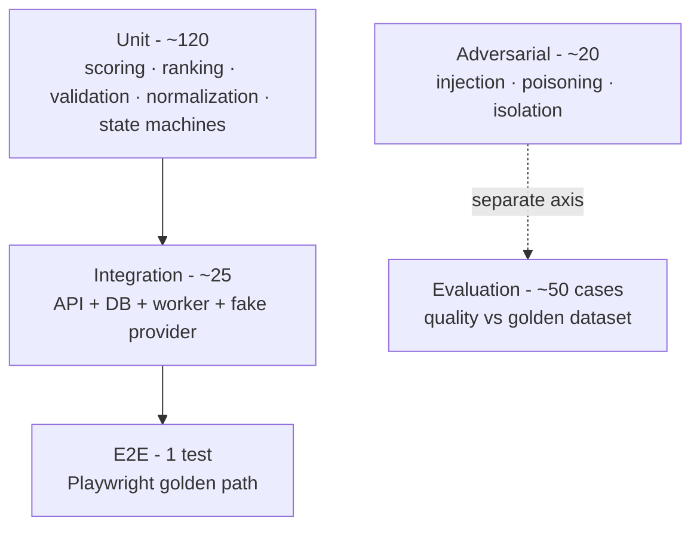
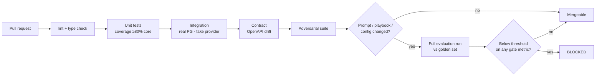

# Test strategy

| | |
|---|---|
| Status | Proposed |
| Updated | 2026-09-07 |

## Two layers, kept apart

| Layer | Question | Nature | Runs |
|---|---|---|---|
| Software tests | Does the code do what it's supposed to? | Deterministic, binary | Every commit |
| Agent evaluations | Is the output any good? | Statistical, threshold-based | Gated, on demand and pre-merge |

Mixing these gives you flaky CI and meaningless metrics. Keeping them apart is what makes the
regression gate trustworthy. A gate that fails for reasons you can't act on gets disabled, and a
disabled gate is worse than no gate because it looks like protection.

## The pyramid

### Unit, around 120

Pure logic, no I/O, no model. Retrieval ranking with fixed vectors. Feedback normalization across
every event type. Playbook selection with a seeded RNG. The memory validation checks. Task and job
state machines. The deterministic quality checks. Edit distance.

Coverage lives here (80% on core logic), because the logic lives here.

The spike harness already has a working example of the shape: the AC-coverage and required-case-type
scoring functions have an assertion-based self-test that passes, written before those functions were
trusted with real output.

### Integration, around 25

Real Postgres, fake LLM provider. Task lifecycle end to end. Job claim, lease expiry, reclaim after
a killed worker. Poison-job bounded retry. Memory CRUD including deletion completeness. Tenant
scoping on every repository method. Trace persistence on a *failed* task. Idempotent task creation.
API contract against the generated OpenAPI schema.

The fake provider is deliberate. These tests answer whether the plumbing works, so they need to be
fast and deterministic. Model behaviour is the evaluation layer's job. Mixing the two gives you a
slow suite that fails for reasons you can't act on.

### End to end, one test

Playwright, golden path only: submit, result, applied-lessons panel, per-case feedback, candidate
memory confirmation. One test, high value, low maintenance. E2E is expensive to maintain and this is
a local single-user app.

### Contract

The OpenAPI schema is generated from Pydantic models, and a test asserts the committed schema
matches the generated one, so drift fails CI instead of surfacing in the browser. Both provider
implementations run against a shared contract suite.

## Evaluation dataset

| | |
|---|---|
| Size | ~50 cases, stratified across the four playbook types |
| Composition | ~30 hand-written, ~20 derived from open-source issue trackers and public specs |
| Per case | Requirement text, type, expected properties (required case types, enumerated ACs, must-not-contain assertions), labelled relevant memories for retrieval scoring |
| Held-out split | A slice never used for prompt tuning, so the evaluation set doesn't quietly become the training set. It's also the split a future fine-tune would be measured on |
| Versioning | Content hash. Any edit is a new version, and runs across versions aren't comparable, so the tooling refuses to chart them as if they were |
| Cost | 15 to 25 hours. Real work, on the critical path |
| Publishable | Yes, synthetic and open-source only |

Already started. Twenty synthetic requirements exist from the model spike, five per playbook type,
each with four machine-checkable acceptance criteria. They were written for benchmarking but they
drop straight into this, which removes roughly a third of the authoring effort.

The hand-written majority is on purpose. Derived cases give realism, but only hand-written ones let
you state expected properties precisely enough for deterministic scoring. Precision beats realism
when the metric has to mean something.

## Adversarial suite

Around 20 scenarios. This is the part most agent projects don't have.

| Class | Scenarios |
|---|---|
| Injection via requirement | "Ignore previous instructions". Instructions hidden in acceptance criteria. Role-play framing. Encoded payloads. Instructions inside code blocks in the requirement |
| Injection into memory | Correction text shaped as a system instruction. An overlong "rule" carrying a payload. A rule crafted to suppress required case types on all future tasks. Assert: caught by the instruction-shape screen or surfaced at the confirmation gate, never silently stored |
| Feedback poisoning | A burst of adversarial feedback trying to flip playbook selection. Score-range escape. Minimum-observation bypass. Assert: scores stay clamped, no single event flips selection |
| Cross-tenant isolation | Retrieval from tenant A while tenant B holds very similar memories. Direct object reference on every id-bearing endpoint. Export scoping. Assert: zero leakage |
| Output handling | Model output containing script tags, path traversal strings, SQL-shaped text, enormous fields. Assert: validated and escaped, never interpreted |
| Degenerate input | Empty requirement. Requirement at the length cap. Non-English text. A requirement that's nothing but an injection payload |
| Provider failure | Provider down mid-task, timeout, malformed response, context limit exceeded |

On tool misuse: NOVA has no external tools. No shell, no file access, no network beyond the model
provider. That's a security property worth stating plainly rather than dressing up. The tool surface
is the LLM gateway and the database, both covered above. Claiming a richer tool-misuse story than
the architecture supports would be exactly the inflation this project exists to avoid.

## Retrieval quality

Against the labelled relevance set:

- Precision@5 and recall@5 against hand-labelled relevant memories per case
- Rank correlation: do more relevant memories actually score higher, not just appear?
- Threshold sensitivity: sweep the cutoff, record where precision and recall trade off, and commit
  to a value with the curve as justification rather than picking one by feel
- Weight sensitivity: vary the similarity, recency, and confidence weights. If results barely move,
  the weights are decorative and should be simplified. That's a useful negative result
- Pinning: pinned in-scope memories always retrieved regardless of similarity
- Scale: precision as the store grows from 10 to 100 to 500 memories. Degradation is expected, and
  should be measured rather than discovered later

## CI gates

| Gate | Blocks merge? |
|---|---|
| Lint, type check, unit, integration, contract | Yes |
| Adversarial suite, any failure | Yes, unconditionally |
| Cross-tenant isolation | Yes, unconditionally |
| Full evaluation run | Only when prompts, playbooks, or config changed. The expensive gate runs only when it can tell you something |
| Evaluation metric below threshold | Yes. This is AC-8, the criterion that proves the quality system is real |

Thresholds come from measured variance, not from what I'd like them to be. Baselines get set once
the harness exists, with margins accounting for observed run-to-run variance. That isn't possible
yet: variance hasn't been measured, and it's a prerequisite in the
[readiness doc](08-readiness-checklist.md).

## Metrics

Each one has a definition, a reason, a collection method, and a known weakness. No measured values
exist for most of these, and every target is a draft.

| ID | Metric | How it's computed | Draft target | Main weakness |
|---|---|---|---|---|
| M1 | Task success rate | `completed / (total - user_cancelled)` | ≥95% | Says nothing about quality. A successfully completed bad plan counts as success. Never quote it as a quality number |
| M2 | Structured-output validity | `valid_first_attempt / total_generations`, also reported post-repair | ≥98% first attempt | Structure only. A schema-valid plan can be worthless. Measured 12 of 12 in the spike, far too small to call a rate |
| M3 | AC coverage | `ACs_with_at_least_one_linked_case / total_ACs` | ≥90% | Needs machine-parseable ACs, degrades on prose requirements. Trusts the model's own AC linking, so it's an upper bound |
| M4 | Required case-type presence | mean over plans of `required_types_present / required_for_playbook` | ≥85% | Trusts the model's own `case_type` labelling. A mistagged case inflates it. Spot-audit periodically and say so |
| M5 | Duplicate case rate | cases with within-plan cosine similarity above θ | ≤10% | θ is arbitrary and has to be fixed and documented. Legitimately similar cases can get flagged |
| M6 | Correction recurrence rate | corrections reappearing as errors on later similar tasks over total confirmed corrections | ≤20% | Depends entirely on the "structurally similar" threshold. Can't tell "retrieved and ignored" from "never retrieved" without the trace, so it always gets reported next to M7 |
| M7 | Retrieval precision@5 / recall@5 | against the labelled relevance set | ≥70% / ≥60% | Labels are one person's judgment on a small set. Relevance is partly subjective |
| M8 | Evaluation pass rate | `cases_passing_all_gates / total_cases` | ≥85% | Only as good as the dataset. A narrow dataset gives a flattering number |
| M9 | Provider call failure rate | `failed_calls / total_calls` | ≤2% | Local failures are mostly environmental (VRAM, model not pulled), so it tracks environment health more than code health |
| M10 | Latency percentiles | p50, p95, p99, end to end and per step | Set from data | Hardware-specific and meaningless without stating GPU, model, and quantization. Cold model load gets reported separately: one spike measurement was 115 s cold against 18 to 21 s warm for the same model |
| M11 | Cost per completed task | tokens and wall clock locally, actual spend for cloud | n/a locally | Local inference has no marginal token cost, so a dollar figure would be made up. Report tokens and wall clock |
| M12 | Regression rate | cases passing in run N-1 and failing in run N | ≤5% | Only comparable within a dataset version. Sensitive to nondeterminism, mitigated by fixed seeds, and the residual variance has to be measured before thresholds get set |

M6 is the headline. It's the thesis made falsifiable, so it gets reported honestly including any run
where it gets worse.

## Manual exploratory testing

Charter-based, time-boxed to about an hour each. Automation won't catch everything.

| Session | Charter |
|---|---|
| Real usage | Use NOVA on genuine requirements from my own projects, log every friction point |
| Memory manager | Deliberately create contradictory, overlapping, and absurd memories, see how it copes |
| Trace comprehension | Hand the trace viewer to someone unfamiliar. Can they explain what happened? If not, the observability is decorative |
| Adversarial by hand | Try injections the automated suite doesn't cover. Creativity beats a fixed list |
| Cold start | Fresh database. Is a first-time experience coherent? |
| Failure UX | Kill Ollama mid-task. Is the error actionable or mysterious? |

Findings get logged as issues with severity, not fixed silently. The issue list is itself evidence
of systematic testing rather than ad-hoc poking.

## Production-like validation

There is no production. The nearest equivalents, stated as such:

- Clean-clone `docker compose up` on a second machine or fresh VM, which catches the class of bug
  that only shows up when your dev machine's accumulated state isn't there
- Soak run of 50+ tasks in sequence, watching for memory growth, trace bloat, retrieval degradation
- Restore-from-backup drill
- Reproducibility check: same seed, pinned model, pinned config gives the same result. If this
  fails, every regression comparison is noise

## Defect triage

| Severity | Definition | Response |
|---|---|---|
| S1 | Data loss, cross-tenant leakage, unbounded resource use | Stop feature work. Fix, add a regression test, then continue |
| S2 | Core workflow broken | Fix within the current milestone |
| S3 | Degraded quality or confusing UX | Backlog with an issue |
| S4 | Cosmetic | Backlog, may never get fixed |

Every S1 and S2 gets a failing test written before the fix. The test is the evidence the bug is
understood, the fix is what makes it pass. For agent-quality defects the regression test is a new
evaluation case added to the golden dataset, which is how the dataset earns coverage over time
instead of being written once and left to rot.

## Open questions

| ID | Question | Resolution |
|---|---|---|
| TS-01 | Is 50 cases enough signal for gating? | If run-to-run variance is too high, grow the dataset rather than loosening thresholds |
| TS-02 | Are fixed seeds enough for reproducible local inference? | Verify early. Both M12 and the reproducibility NFR depend on it |
| TS-03 | Do the evaluation frameworks drive a local Ollama endpoint cleanly? | Verify before building the harness on that assumption |
| TS-04 | Is the held-out split meaningful at n=50? | Open. May need a bigger dataset to be defensible |
| TS-05 | How far can M3 and M4 be trusted given they rely on model self-labelling? | Hand-audit a sample of plans and report the agreement rate |
