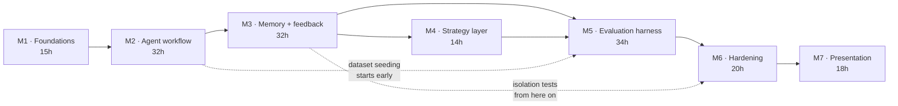

# Delivery plan

| | |
|---|---|
| Status | Proposed |
| Budget | ~165 hours, 10 to 15 hrs/week |
| Updated | 2026-09-07 |

## Budget reality

| Availability | Weeks to 165 h | Verdict |
|---|---|---|
| 15 hrs/week | ~11 weeks | Comfortable |
| 12.5 hrs/week | ~13 weeks | On track for about three months |
| 10 hrs/week | ~16.5 weeks | Over budget, and the first two cuts become mandatory |

Writing that down now so the decision to cut gets made from a plan instead of from panic in week 10.

Hour estimates are judgment, not history. They'll be wrong. The exit criteria are what matter. A
milestone is done when its criteria are met, not when its hours are spent.

## Milestones

Ordered by technical prerequisite and risk, not by which feature is most fun. The biggest unknowns
are front-loaded, because finding out one of them fails in week 10 would be unrecoverable.

### M1 · Foundations, 15 h

Partially done. The model spike has run.

| | |
|---|---|
| Goal | Kill the assumptions that could invalidate the plan, lock the sticky decisions |
| Scope | Model spike, repo skeleton, Postgres + pgvector + Alembic, provider interface with a fake implementation, Compose baseline, CI skeleton |
| Exit | A chosen model produces schema-valid plans at measured latency, embedding model and dimension fixed, Ollama reachable from a container |
| Done so far | Spike partially done, 3 of 5 candidates measured, results committed |
| Not done | Embedding spike, Compose, Alembic, provider interface, CI |

Remaining: finish the model run, run the embedding spike, verify host-Ollama reachability from a
container, then the scaffolding.

### M2 · Agent workflow, 32 h

| | |
|---|---|
| Goal | End-to-end task execution with no memory and no learning. The substrate everything else attaches to |
| Scope | Task entity and state machine, job table and worker, orchestrator, generator, deterministic checks, trace persistence, minimal UI, four playbooks as static data |
| Exit | A requirement submitted in the browser returns a schema-valid plan, the trace shows every step, and a killed worker's job gets reclaimed with the partial trace intact |
| Also starts | Expanding the evaluation dataset from the 20 spike requirements. Starting now spreads the cost and forces early clarity on what "expected properties" means |
| Must settle before M3 | Test-plan schema v1 frozen, playbook definitions stable enough to scope memory against |

### M3 · Memory and feedback, 32 h

The one the project exists for.

| | |
|---|---|
| Goal | Close the loop |
| Scope | Memory entity and pgvector index, embedding on confirm, retrieval with scoring, feedback events and normalization, extraction with validation checks, confirmation flow, conflict detection, memory manager UI, applied-lessons panel |
| Exit | A correction on task N visibly changes task N+1, deleting the memory reverts it, isolation tests green in CI |
| Done means | Extraction precision measured on ~15 hand-labelled real corrections, deletion completeness proven by test |
| Risk | Extraction precision is the biggest unknown in the project |

Checkpoint at about 15 hours in: measure extraction precision before building the surrounding UI. If
a local model can't turn corrections into usable rules, the fallback is user-authored rules with
model assistance. Smaller feature, still honest, and far cheaper to pivot to at that point than
after the UI sits on top of it.

### M4 · Strategy layer, 14 h

| | |
|---|---|
| Goal | Make playbook choice respond to measured outcomes, with guardrails |
| Scope | Outcome score entity, bounded exploration, cold-start defaults, exploration labelling in the UI, score recomputation from events |
| Exit | Selection shifts after recorded outcomes, exploration stays in bound, scores rebuild correctly from the event log |
| Demo | Feed outcomes, watch selection shift, then wipe scores and rebuild them from events |

Smallest milestone, off the critical path, and the natural first cut.

### M5 · Evaluation harness, 34 h

| | |
|---|---|
| Goal | Make quality measurable and regression impossible to merge |
| Scope | Dataset to ~50 stratified cases (15 h on its own), metric computation, adversarial suite, prompt/config versioning with the promotion gate, CI evaluation job, results view |
| Exit | A deliberately worsened prompt gets blocked by CI |
| Done means | Run-to-run variance measured before thresholds get set, thresholds justified by that variance in writing, adversarial suite green, recurrence rate measured across two or more runs |
| Risk | Nondeterminism causing flapping gates, and the dataset being underestimated |

The biggest milestone and the one most likely to overrun, because of the dataset. It also produces
the artifact most worth talking about in an interview, so cutting here costs the most per hour
saved.

### M6 · Hardening, 20 h

| | |
|---|---|
| Goal | Make it operable and prove the security properties |
| Scope | Tracing, cost and latency surfacing, structured logging with content-free assertions, degraded modes, health and readiness including provider reachability, secret scanning and dependency audit in CI, backup and restore drill, clean-clone verification |
| Exit | Every degraded mode demonstrable, no content in logs (asserted by test), clean clone works on a second machine |
| Demo | Kill Ollama mid-task and get an actionable error instead of a spinner. Switch providers explicitly. Restore from backup |

### M7 · Presentation, 18 h

| | |
|---|---|
| Goal | Make the work legible to someone with five minutes |
| Scope | README, architecture doc finalization, case study, demo recording, screenshots, filling or removing every placeholder |
| Exit | Every placeholder is either filled with a measured value or the claim is gone |
| Risk | The pull to fill placeholders optimistically peaks right here, when the work is nearly done. Re-read the claim rules at the start of this milestone, not the end |

## Critical path

M1, M2, M3, M5, M6, M7. M4 is the only one off it.

The two highest-variance items on the path are M3 extraction precision and M5 dataset construction.

## Vertical slices

Each slice delivers something you can show, rather than a horizontal layer.

| Slice | Milestone | What you can demo |
|---|---|---|
| S1 · Requirement in, plan out | M2 | Paste a requirement in the browser, get a schema-valid plan |
| S2 · Durable async execution | M2 | Kill the worker mid-task, job gets reclaimed, partial trace survives |
| S3 · Trace visibility | M2 | Open a completed task, read every step, timing, token count |
| S4 · Per-case feedback | M3 | Accept, edit, reject individual cases, events persist |
| S5 · Correction to memory | M3 | A freeform correction produces a candidate, confirming it stores a memory with provenance |
| S6 · Memory applied | M3 | A later similar requirement retrieves and applies it, visibly, with a score |
| S7 · Memory reverted | M3 | Delete the memory, re-run, behaviour disappears |
| S8 · Conflict surfacing | M3 | Two contradictory rules detected and shown instead of silently resolved |
| S9 · Strategy responds | M4 | Selection shifts after outcomes, scores rebuild from the event log |
| S10 · Quality measured | M5 | Evaluation run against the golden dataset reports every metric |
| S11 · Regression blocked | M5 | A worsened prompt fails CI |
| S12 · Adversarial green | M5 | Injection, poisoning, isolation scenarios all pass |
| S13 · Operable | M6 | Degraded modes behave, clean clone starts, backup restores |
| S14 · Legible | M7 | Demo, screenshots, docs, honest numbers |

S6 and S7 together are the demo. S7 is what converts a skeptic, because it proves causation instead
of asserting it. S11 is what lands with a test-engineering interviewer.

## Ready to start

A slice is ready when:

- [ ] Its acceptance criteria are written and testable
- [ ] The data it reads and writes is defined in the data model
- [ ] Its failure modes are named, with intended behaviour for each
- [ ] Any decision it depends on is either recorded or has an explicit default
- [ ] It's demonstrable on its own, without waiting for a later slice

## Done

A slice is done when:

- [ ] Acceptance criteria pass
- [ ] Unit tests cover the non-trivial logic it introduced
- [ ] Any new repository method is tenant-scoped and has an isolation test
- [ ] Failure paths are exercised, not just the happy path
- [ ] Trace or logging covers what I'd need to debug it in three months
- [ ] Docs touched by the change are updated in the same commit
- [ ] No new claim went in without evidence behind it

## Cut order

Decided now, while nothing is on fire:

1. Evaluation dashboard UI becomes a CLI report plus committed Markdown
2. Playbooks 4 to 2, which keeps the strategy layer real and halves the work
3. Pluggable cloud provider drops to local only, which costs the demo fallback
4. Memory edit and pin drop to view and delete
5. Evaluation dataset 50 to 25 cases
6. Cost and latency move from the UI to logs

Never cut: the feedback loop, memory isolation tests, the evaluation regression gate. Those three are
the project. Drop any of them and what's left is a generic LLM wrapper.

Decide on cuts in week 6, not week 12.

## Work that fits a low-energy session

Not really parallel with one person, but none of it blocks anything:

- Evaluation dataset authoring, from M2 onward. Pure content work
- ADRs, written as decisions get made rather than after. Retroactive ADRs read as fiction and an
  experienced reviewer can tell
- README and architecture drafting
- Screenshots as features land, so M7 isn't a scramble

## Assumption validation order

| Rank | Assumption | Milestone | If it fails |
|---|---|---|---|
| 1 | A local model holds the schema at usable latency | M1 | Done. 12 of 12 schema-valid, 9 to 26 s warm, fully on GPU |
| 2 | Corrections extract into reusable rules | M3, mid-milestone | Fall back to user-authored rules with model assistance |
| 3 | "Structurally similar" is definable enough for the headline metric | M3 to M5 | Replace it with a weaker but honest per-case regression metric |
| 4 | Deterministic checks capture enough quality to gate on | M5 | Increase the LLM-judge share, document the caveat |
| 5 | Nondeterminism stays inside gate margins | M5 | Grow the dataset. Don't loosen thresholds |

## After the MVP

Roughly in value-for-effort order:

1. Generating runnable test code. Highest perceived value, biggest scope
2. Multi-user auth. Schema is ready, adds real backend and security depth
3. Bug-report workflow as a second task type. About 80% infrastructure reuse, proves the
   architecture generalizes
4. Issue tracker ingestion, to kill the copy-paste
5. Team-shared memory with review. Needs item 2 first
6. Cloud deployment, only if a live URL becomes worth it
7. Fine-tuning

On item 7: the MVP produces everything a fine-tune would need, which is why it's last rather than
excluded.

| Prerequisite | Where it comes from |
|---|---|
| A labelled dataset of decent volume | Accumulated accept/edit/reject records and confirmed corrections. The MVP is the data collection phase |
| A measured baseline | Evaluation targets measured across two or more runs |
| A held-out set never seen in training | The golden dataset split, fixed and documented before any training |
| Reproducible training config | Pinned base model, seed, hyperparameters, dataset version hash |
| Hardware headroom | Needs its own spike. 6 GB is tight, and sequence length and batch size will bind |

If it ships, the framing is: prompt-plus-memory established a baseline, a fine-tune moved it to some
measured value on a held-out set. If it doesn't beat the baseline, that's a real result worth
publishing. Small-model fine-tuning loses to good retrieval fairly often. A negative result measured
properly is a better artifact than a positive one you can't defend.

None of that is an excuse to call NOVA self-training before the fine-tune exists.
