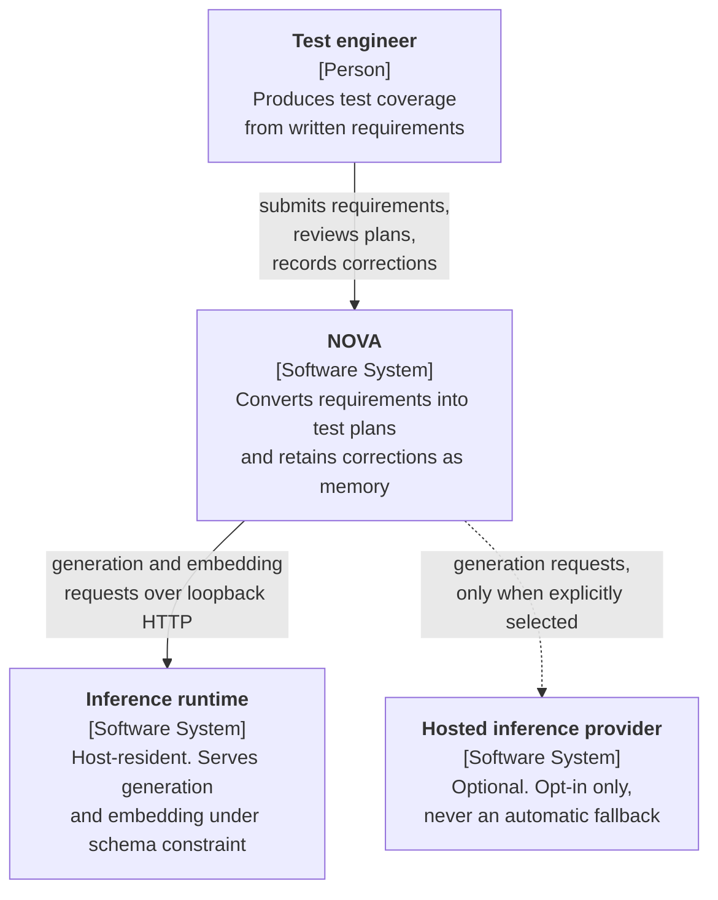
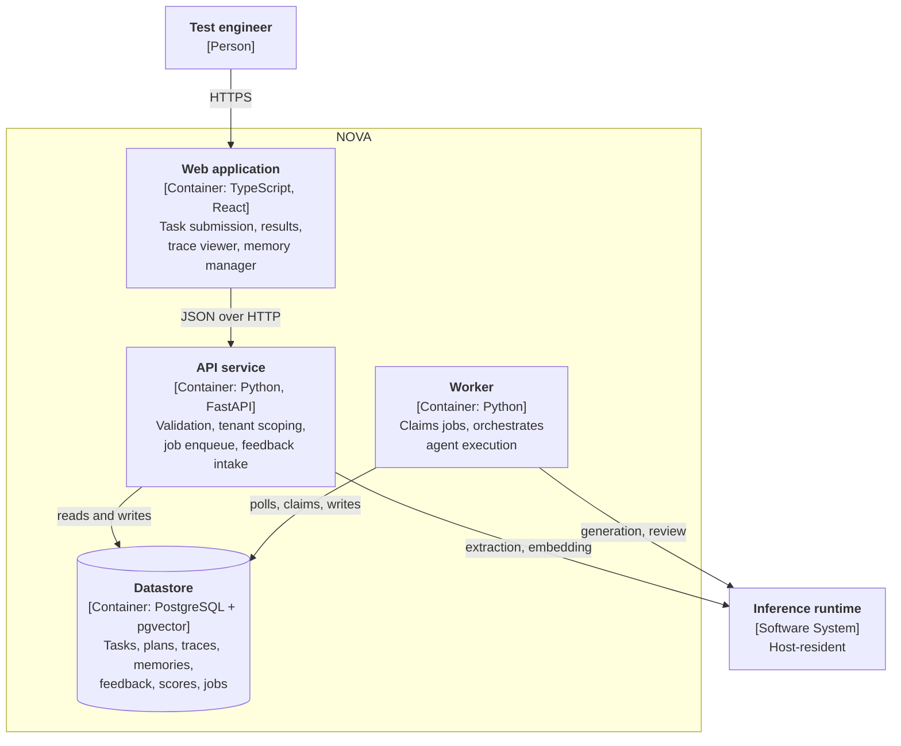
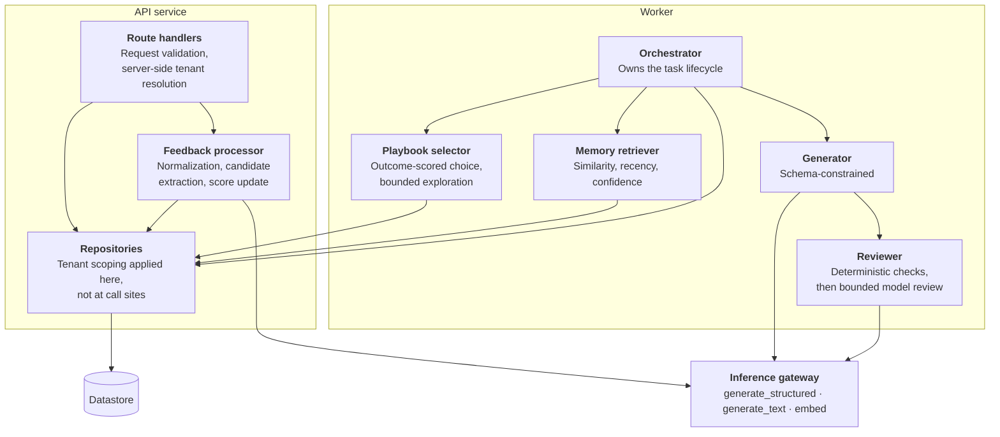
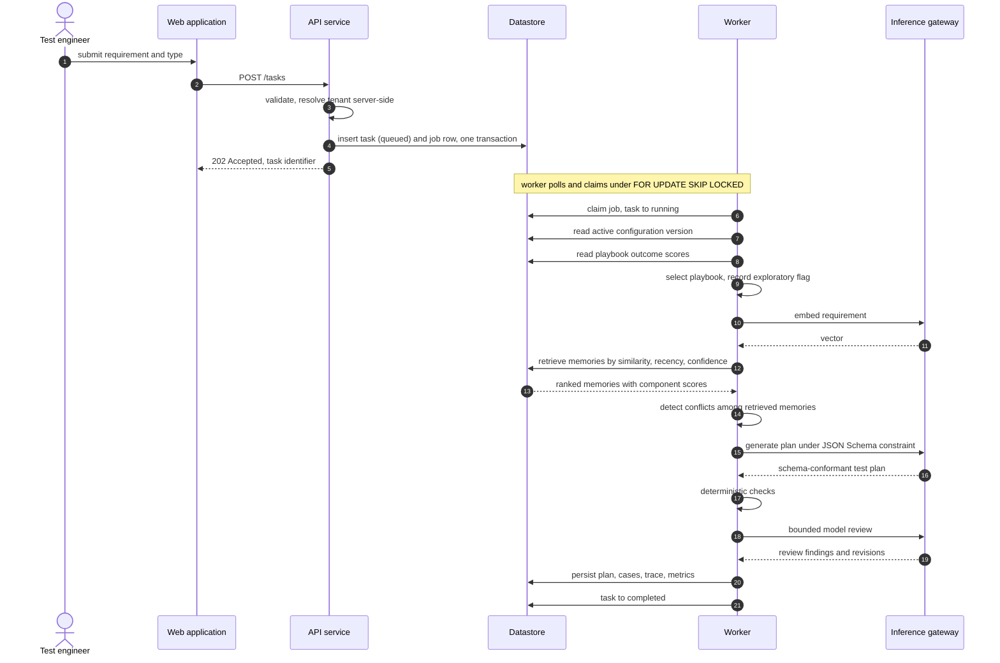
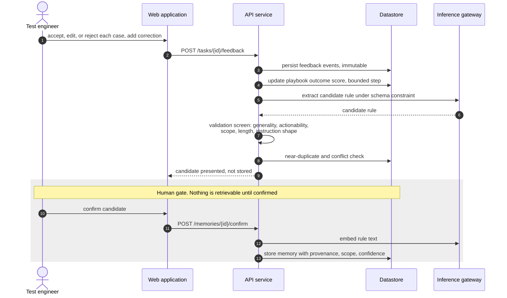
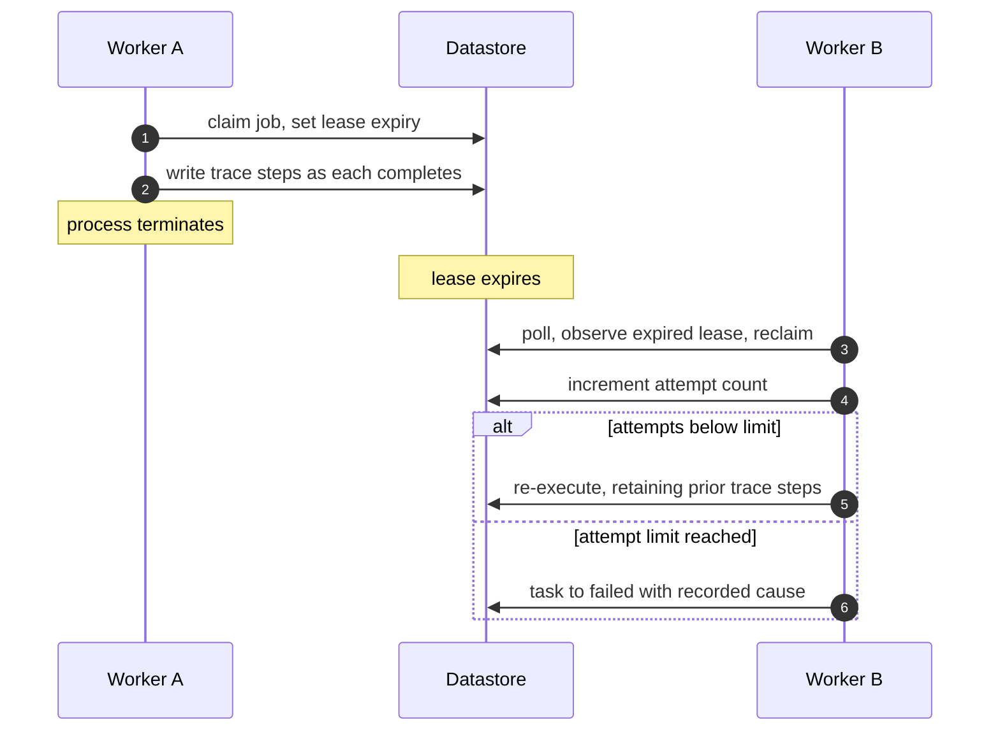
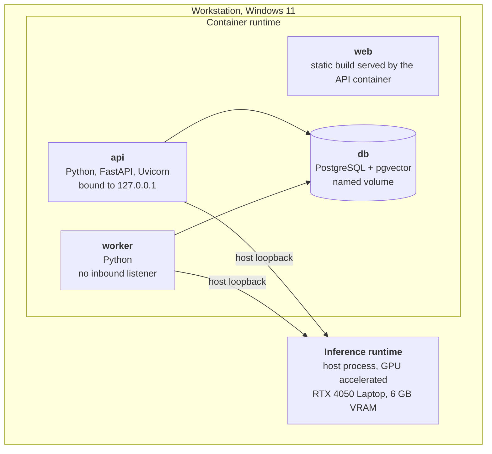
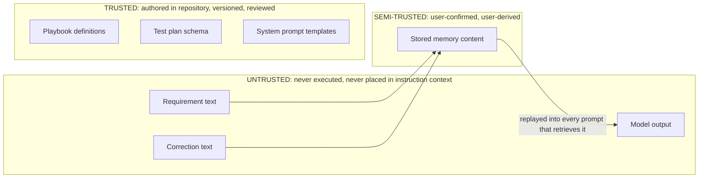
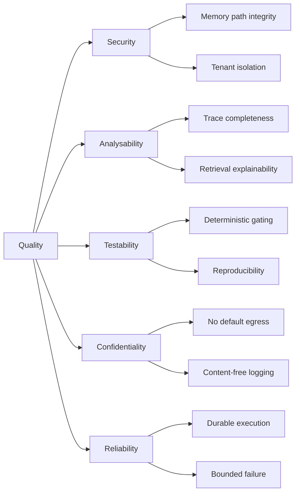

# Software Architecture Document

| Field | Value |
|---|---|
| Document ID | NOVA-SAD-001 |
| Version | 0.3 |
| Status | Draft |
| Owner | Laxmi Poudel |
| Date | 2026-09-08 |
| Conforms to | arc42 v9, C4 model, ISO/IEC/IEEE 42010:2022 |

---

## 1. Introduction and goals

NOVA converts a natural-language software requirement into a structured test plan, and retains the
user's corrections as durable memory so that later work does not repeat the same errors.

Generation is not the architecturally interesting part. The design problem is the loop around it:

1. Converting a freeform correction into a durable, retrievable rule without creating a persistent
   prompt-injection vector.
2. Retrieving the right rules without an ever-growing prompt that degrades silently.
3. Establishing whether any of it works.

### 1.1 Requirements overview

The authoritative requirement set is [NOVA-SRS-001](srs.md). The architecturally significant subset:

| ID | Requirement | Architectural consequence |
|---|---|---|
| FR-2 | Schema-conformant generation via constrained decoding | Schema is a first-class shared artifact, not a post-hoc validator |
| FR-4 | Scored retrieval with scores exposed | Retrieval must be explainable, not merely correct |
| FR-6.3 | No memory stored without explicit confirmation | A human gate sits on the highest-risk write path |
| FR-8 | Complete execution trace, including on failure | Tracing is a structural concern, written incrementally |
| FR-10.1 | Configuration activation requires a passing evaluation | Enforced as a data-layer constraint |
| NFR-16 | Tenant scoping applied at the data access layer | Isolation is structural, not a per-caller convention |
| NFR-20 | The model has no file, command, or network capability | The absence of a tool surface is a designed property |
| NFR-2 | Task duration measured in tens of seconds | Execution is asynchronous and durable |

### 1.2 Quality goals

Ordered. Where two conflict, the higher-ranked prevails.

| Rank | Quality goal | Motivation | Scenario reference |
|---|---|---|---|
| 1 | **Security of the memory path** | A confirmed memory is replayed into every future prompt that retrieves it. Compromise is persistent, not transient | QS-1, QS-2 |
| 2 | **Analysability** | The value of the system depends on being able to show why an output was produced, and on separating retrieval failure from generation failure | QS-3, QS-4 |
| 3 | **Testability** | Improvement claims are only meaningful if they are measurable and gated | QS-5, QS-6 |
| 4 | **Confidentiality** | Requirements and test data must not leave the host in the default configuration | QS-7 |
| 5 | **Reliability** | A task must not vanish, hang, or lose its trace on failure | QS-8, QS-9 |

Performance is deliberately absent from this list. Measurement established substantial headroom
against the stated target, so it does not currently constrain design.

### 1.3 Stakeholders

| Stakeholder | Concern | Consumed views |
|---|---|---|
| Implementing engineer | Buildability, decision rationale | All |
| Technical reviewer | Engineering judgment, measurement rigour | 4, 8, 9, 10, 11 |
| Operator | Deployment, failure diagnosis | 7, 8 |
| Primary user | Explainability of output | 6, 8 |

## 2. Architecture constraints

| ID | Constraint | Consequence |
|---|---|---|
| CON-1 | Approximately 130 to 180 engineering hours | One datastore, no framework, no infrastructure that is not load-bearing |
| CON-2 | Single engineer, no external review | Automated gates substitute for peer review where they can |
| CON-3 | Local inference within a 6 GB VRAM budget | Structured-output reliability becomes a primary engineering problem. Model class is 4B parameters, not 8 to 9B |
| CON-4 | Local deployment only | Container composition is the deployment artifact. Inference runs on the host, not in a container |
| CON-5 | Synthetic and open-source data only | Evaluation data is committable. Privacy controls are designed and tested rather than compliance-bound |
| CON-6 | No model training | All adaptation occurs through retrieval and configuration, not weights |
| CON-7 | Single user, multi-tenant-capable schema | Tenant identifier present from the first migration; authentication deferred |

## 3. Context and scope

### 3.1 Business context (C4 level 1)

| External entity | Interface | Notes |
|---|---|---|
| Test engineer | Browser, HTTP | The only human actor. No administrative role exists |
| Inference runtime | HTTP on the host loopback interface | Supplies a JSON Schema per request; returns a conformant completion plus token and timing telemetry |
| Hosted inference provider | HTTPS | Optional. Selecting it is the only path by which data leaves the host, and it requires an explicit user action |

### 3.2 Technical context

| Channel | Protocol | Payload | Trust |
|---|---|---|---|
| Browser to API | HTTP/1.1, JSON | Requirements, feedback, memory operations | Untrusted input |
| API to datastore | PostgreSQL wire protocol | All persistent state | Internal |
| Worker to inference runtime | HTTP/1.1, JSON with JSON Schema | Prompts and completions | Output untrusted |
| API to inference runtime | HTTP/1.1, JSON | Extraction and embedding requests | Output untrusted |

Services bind to the loopback interface. The system has no inbound network surface beyond the host.

## 4. Solution strategy

| Quality goal | Approach | Rationale |
|---|---|---|
| Security of the memory path | Two independent controls in series: a mechanical validation screen, then mandatory human confirmation. Combined with a total absence of tool capability for the model | A screen against an open-ended attack surface will miss cases. A successful injection can produce a poor test case but cannot take an action, because no action exists. See [ADR-0004](adr/0004-require-human-confirmation-for-memory-writes.md) |
| Analysability | Trace steps written incrementally, including retrieval scores for candidates that were evaluated and rejected | A trace persisted only on success is useless, because failure is when it is needed. Scores for non-selected candidates are what separate retrieval failure from generation failure |
| Testability | Deterministic checks first, model-based review confined to the residual. Evaluation dataset versioned by content hash. Configuration activation blocked at the data layer without a passing run | Model-based evaluation makes every metric dependent on a component whose reliability must itself be established |
| Confidentiality | Local inference by default. Provider changes require explicit user action. Logs carry identifiers and digests, never content | Automatic provider substitution would silently change where data goes |
| Reliability | Durable job records claimed under row-level locks with lease expiry. Every retry bounded with a defined terminal state | An agent that retries without bound consumes a GPU and presents as a hang |

Technology selection follows from the constraints rather than preference: a single datastore holding
both relational and vector data ([ADR-0001](adr/0001-use-postgres-with-pgvector-as-sole-datastore.md)), a job
table rather than a broker ([ADR-0002](adr/0002-use-a-postgres-job-table-for-async-execution.md)), and no
agent framework ([ADR-0003](adr/0003-do-not-use-an-agent-framework.md)).

## 5. Building block view

### 5.1 Level 1: containers (C4 level 2)

### 5.2 Level 2: API service and worker components

### 5.3 Component responsibilities

| Component | Responsibility | Principal failure mode and response |
|---|---|---|
| Web application | Submission, results with per-case actions, trace viewer, memory manager, evaluation results | API unreachable, long task appearing stalled, large trace rendering slowly. Explicit error states, polling backoff, trace pagination. Renders untrusted content, so no unsanitized markup |
| Route handlers | Validation, server-side tenant resolution, job enqueue | Validation failure returns a structured error. Datastore failure returns 503 with no partial write |
| Repositories | All data access, tenant-scoped by construction | A query path that omits tenant scoping is prevented structurally rather than by convention |
| Feedback processor | Normalization, candidate extraction, score update | Extraction failure retains the raw correction rather than discarding it. Highest-risk path in the system |
| Orchestrator | Task lifecycle: select, retrieve, generate, check, review, persist | Any step failure records the failing step by name and persists the trace to that point |
| Playbook selector | Outcome-scored choice with bounded exploration | Cold start falls back to a static mapping. Bounded step size and clamping prevent a single event from changing the selection |
| Memory retriever | Ranked retrieval with explainable component scores | Embedding failure fails the task explicitly. A silent empty retrieval is the worst available outcome, because the system continues to appear healthy while no longer learning |
| Generator | Schema-conformant plan production | Bounded repair retry with every attempt counted. Context pressure reduces retrieved memory before requirement text |
| Reviewer | Deterministic checks, then bounded model review | The model review stage is optional by design. Deterministic verdicts return regardless, flagged partial. The pre-review plan is retained so any regression is visible |
| Inference gateway | Three operations over two provider implementations | Startup health check returns an actionable message. No silent provider substitution |
| Job store and worker loop | Durable asynchronous execution | Lease expiry permits reclamation after worker termination. Bounded attempts, then terminal failure. Partial trace always retained |

The gateway exposes three operations, not a general abstraction layer. Anything wider would be
speculative.

## 6. Runtime view

### 6.1 Nominal task execution

### 6.2 Correction to durable memory

### 6.3 Worker termination and recovery

### 6.4 Synchronous and asynchronous boundaries

| Operation | Mode | Rationale |
|---|---|---|
| Task submission | Synchronous, returns identifier | Execution takes tens of seconds |
| Task execution | Asynchronous worker | Durability and observable status |
| Status and result retrieval | Synchronous polling | Server-sent events only if polling proves inadequate |
| Feedback submission | Synchronous | Write-only, fast |
| Candidate extraction | Synchronous, within the feedback request | A single short call, and the user is awaiting the candidate |
| Embedding on confirmation | Synchronous | Sub-second locally |
| Evaluation runs | Asynchronous, offline | Minutes in duration. Never in a request path |

## 7. Deployment view

| Node | Rationale |
|---|---|
| Application containers | Reproducible startup from a clean checkout by a single command |
| Datastore container with a named volume | State survives container replacement. Backup is a documented dump and restore |
| Inference on the host, not containerized | GPU passthrough on this platform adds operational friction without benefit. The container-to-host path requires verification and documentation, and is the most likely first-run obstacle for anyone cloning the repository |

## 8. Crosscutting concepts

### 8.1 Domain model

| Concept | Definition |
|---|---|
| Task | One execution of the requirement-to-plan workflow. The anchor for plan, trace, and feedback |
| Test plan | A summary and an ordered set of test cases, conforming to a versioned schema |
| Memory | A durable rule derived from a correction, carrying provenance, scope, confidence, and lifecycle state |
| Playbook | A named generation strategy: required case types, prompt fragment, check configuration. Versioned repository data, not code |
| Feedback event | An immutable record of one user judgment. The authoritative source from which scores are derived |
| Execution trace | The ordered record of every step, model call, and score for one task |

### 8.2 Trust boundaries and security

Stored memory is a persistent injection vector. A single injected requirement affects one task. An
injection surviving extraction and confirmation is replayed into every subsequent prompt that
retrieves it, which is structurally equivalent to stored cross-site scripting.

Seven layers apply, none relied upon alone: structural separation of untrusted content, constrained
decoding bounding the output shape, output validation, instruction-shape screening on candidates,
human confirmation, absence of any tool surface, and an adversarial regression suite. The sixth is
the strongest, and it derives from the architecture rather than from a filter.

Full analysis in [NOVA-TM-001](threat-model.md).

### 8.3 The learning mechanism

Adaptation occurs at five levels. None involves model weights.

| Level | Mechanism | Persistence |
|---|---|---|
| L0 | Working context, assembled per task | None |
| L1 | Episodic records of tasks, outputs, outcomes | Database rows |
| L2 | Semantic rules extracted from corrections | Database rows with provenance |
| L3 | Scored retrieval over those rules | Query-time |
| L4 | Outcome-scored playbook selection | Derived scores |
| L5 | Evaluation-gated configuration change | Versioned records |

**Feedback normalization.** Events map to a bounded score in [-1, +1]: unedited acceptance `+1.0`,
minor edit `+0.5`, major edit `0.0`, rejection `-1.0`, user-added case `-0.5`, abandonment `-0.2`,
export `+0.3`. The task outcome is the clamped mean of case-level contributions.

Three choices carry rationale. Clamping prevents a single large plan from dominating. A missed case
is penalized less than an incorrect one, because omission is cheaper to remedy than a false positive.
A major edit scores zero rather than negative, because the structure remained useful.

Implicit signals (abandonment, export) are weighted well below explicit feedback and never
independently create or modify a memory. Abandonment is inherently ambiguous.

**Retrieval.** `score = w_sim · similarity + w_rec · recency + w_conf · confidence`, initially
`0.6 / 0.2 / 0.2`. Scope and tenant apply as filters before ranking. Pinned in-scope memories return
unconditionally. Component scores for every evaluated candidate, selected or not, are written to the
trace.

**Conflict handling.** Two in-scope memories that are semantically similar but prescriptively opposed
are surfaced, never merged. At confirmation the user chooses; at retrieval the higher product of
confidence and recency prevails and the conflict is flagged. Silent averaging would make the memory
store untrustworthy, because the user could no longer determine what the system holds to be true.

**Strategy selection.** Greedy over recorded outcome scores with probability `1 - ε`, uniform random
otherwise, `ε` starting at 0.1 with a floor of 0.05. Updates are bounded and clamped, so no single
feedback event alters a selection. Below a minimum observation count the static default prevails.

This is a bounded contextual bandit over four fixed options. It is not reinforcement learning and is
not described as such. Four arms and a scalar reward is a modest mechanism, but it is real,
scoreable, and explainable.

Outcome scores are derived, never authoritative, and are recomputable from the immutable feedback
log. A poisoning incident or a change to the weighting scheme is therefore recoverable.

### 8.4 Persistence

A single datastore holds relational and vector data. The determining argument is correctness rather
than performance: with separate stores, writing a memory requires two writes to two systems, and a
partial failure yields either orphaned vector data or a memory that exists but can never be
retrieved. The second fails silently and is indistinguishable from a system that has stopped
learning. Within one transaction the failure mode does not arise.

The embedding dimension is fixed at schema creation. Changing the embedding model requires
re-embedding every memory and rebuilding the index. This is documented rather than discovered, and
is the reason the embedding decision was treated as blocking. It is settled: `embeddinggemma` at 768
dimensions, per [ADR-0005](adr/0005-select-an-embedding-model-and-vector-dimension.md) on the
evidence in NOVA-SPK-002.

### 8.5 Asynchronous execution

Jobs are rows claimed under `SELECT ... FOR UPDATE SKIP LOCKED` with a lease that expires. Because
the job row shares a transaction with the task record, no window exists in which a task is present
without its job. Diagnosis of a stalled job is a query rather than an operational investigation.

### 8.6 Error handling

Errors are returned in RFC 9457 problem-detail form, giving one shape for every failure and one
rendering component. Every retry loop is bounded with a defined terminal state.

Trace steps are written as they complete, so a task failing at generation still exposes its playbook
selection and retrieval results.

### 8.7 Observability

Spans correlate across API, worker, and inference calls. Logs carry identifiers and prompt digests,
never requirement text or memory content, and an automated assertion enforces this. Content logging
exists only as an explicit debug mode. Logging failure degrades to standard output and never blocks
task execution.

Content-free logging is not incidental. Local inference is the confidentiality property, and logs
are the most probable route by which it would be undermined.

### 8.8 Configuration and versioning

Prompt templates, retrieval weights, exploration rate, and model configuration are held as versioned
records. A version reaches active status only with an associated passing evaluation run, enforced as
a data-layer constraint rather than an interface check.

Every task pins the configuration version under which it executed. Without that pin, historical
results are uninterpretable and regression comparison is meaningless.

### 8.9 Testability

Deterministic checks precede model-based review. Integration tests execute against a real datastore
and a fake inference provider, because they exist to verify wiring, and model behaviour is the
evaluation layer's concern. Both provider implementations satisfy a shared contract suite.

## 9. Architecture decisions

Significant decisions are recorded as ADRs in MADR 4.0 format. Remaining decisions are held in
[NOVA-DL-001](decision-log.md).

| ADR | Decision | Status |
|---|---|---|
| [0001](adr/0001-use-postgres-with-pgvector-as-sole-datastore.md) | PostgreSQL with pgvector as the sole datastore | Accepted |
| [0002](adr/0002-use-a-postgres-job-table-for-async-execution.md) | Job table and polling worker rather than a message broker | Accepted |
| [0003](adr/0003-do-not-use-an-agent-framework.md) | No agent framework | Accepted |
| [0004](adr/0004-require-human-confirmation-for-memory-writes.md) | Mandatory human confirmation for memory writes | Accepted |
| [0005](adr/0005-select-an-embedding-model-and-vector-dimension.md) | Embedding model and vector dimension | Proposed |

## 10. Quality requirements

### 10.1 Quality tree

### 10.2 Quality scenarios

| ID | Scenario | Stimulus | Required response |
|---|---|---|---|
| QS-1 | A correction is submitted whose text is shaped as a system instruction | Malicious or accidental input | Screened and flagged. Never stored without explicit user action on the flagged item |
| QS-2 | Retrieval is performed for one tenant while another holds highly similar memories | Query execution | Zero records from the other tenant. Verified as an unconditional gate |
| QS-3 | A task fails during generation | Provider timeout | Playbook selection and retrieval results remain inspectable in the persisted trace |
| QS-4 | Output omits an expected test case | User review | The trace distinguishes a memory that was never retrieved from one retrieved and not applied |
| QS-5 | A prompt change degrades output quality | Configuration change submitted | The regression gate blocks activation before merge |
| QS-6 | A prior execution must be reproduced | Same input, seed, model, configuration version | Equivalent output |
| QS-7 | A hosted provider becomes selected | Configuration action | Only through explicit user action. Never as a fallback. Visible in the interface |
| QS-8 | The worker process terminates mid-task | Process failure | The job is reclaimed after lease expiry. The partial trace survives |
| QS-9 | The inference runtime is unavailable | Dependency failure | Submission still succeeds and queues. Readiness reports unhealthy. The error names the required action |

## 11. Risks and technical debt

| ID | Risk or debt | Severity | Response |
|---|---|---|---|
| R-01 | Correction extraction may not reach usable precision on a local model | High | Measured at a defined checkpoint before dependent interface work. Fallback is user-authored rules with model assistance |
| R-03 | Inference nondeterminism may exceed evaluation gate margins | High | Variance measured before any threshold is set. Dataset grows rather than thresholds loosening |
| R-05 | The Correction Recurrence Rate depends on a structural similarity threshold that is difficult to defend | Medium | Threshold fixed from measured distributions, documented, held constant, and always reported alongside retrieval precision |
| R-09 | Container-to-host inference reachability is unverified on this platform | Medium | Verified before deployment work. Resolution documented |
| R-11 | Persistent injection defences are unproven | Medium | The adversarial suite establishes a floor, not a guarantee, and is described as such |
| R-13 | The model review stage may not justify its latency | Low | Designed to be removable. Measured before and after |
| R-16 | Introducing any tool capability would invalidate the security model | Low | Recorded so that the consequence is not overlooked. Such a change requires rewriting NOVA-TM-001 rather than amending it |
| D-01 | Trace volume has no pruning policy | Low | Acceptable at single-user scale. Named so it is not discovered later |
| D-02 | Memory conflict resolution is manual | Low | Does not scale beyond a moderate memory count. Acceptable at expected volume |

Full register: [NOVA-RR-001](risk-register.md).

## 12. Glossary

See [NOVA-SRS-001 section 1.4](srs.md#14-definitions-acronyms-and-abbreviations).

---

## Revision history

| Version | Date | Author | Change |
|---|---|---|---|
| 0.1 | 2026-09-08 | Laxmi Poudel | Initial draft |
| 0.2 | 2026-09-08 | Laxmi Poudel | Embedding dimension fixed at 768 in section 8.4. R-04 moved to closed |
| 0.3 | 2026-09-08 | Laxmi Poudel | R-08 moved to closed |
