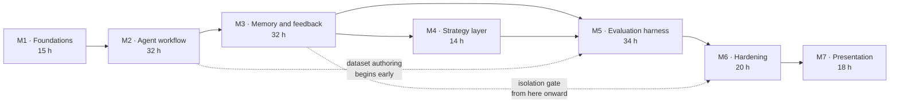

# Software Development Plan

| Field | Value |
|---|---|
| Document ID | NOVA-SDP-001 |
| Version | 0.3 |
| Status | Draft |
| Owner | Laxmi Poudel |
| Date | 2026-09-08 |
| Conforms to | ISO/IEC/IEEE 16326:2019 |

---

## 1. Overview

### 1.1 Project summary

**Purpose and objectives.** Deliver NOVA, a locally hosted agent converting software requirements
into structured test plans and retaining user corrections as durable memory. Objectives are stated
in [NOVA-VS-001 section 1.3](vision-and-scope.md#13-business-objectives-and-success-criteria).

**Scope.** As defined in [NOVA-VS-001 section 3](vision-and-scope.md#3-scope-and-limitations).

**Assumptions and constraints.**

| ID | Constraint | Effect |
|---|---|---|
| CON-1 | Approximately 130 to 180 engineering hours | Scope reduction order pre-committed |
| CON-2 | Single engineer, no external review | Automated gates substitute for peer review where possible |
| CON-3 | Local inference, 6 GB VRAM | Model class fixed at 4B parameters. Confirmed by measurement |
| CON-4 | Local deployment only | Container composition is the deployment artifact |
| CON-5 | Synthetic and open-source data only | Evaluation data is committable |
| CON-6 | No model training | Adaptation through retrieval and configuration only |
| CON-7 | Single user, multi-tenant-capable schema | Tenant identifier present from the first migration |

**Deliverables.**

| Deliverable | Form |
|---|---|
| NOVA application | Source, containerized, startable from a clean checkout |
| Document set | NOVA-VS-001, SRS-001, SAD-001, STP-001, TM-001, SDP-001, RR-001, DL-001, ADRs |
| Evaluation dataset | Content-hash-versioned, committed |
| Automated test suites | Source, gated in continuous integration |
| Spike reports | Committed with reproducible harnesses and raw output |
| Demonstration recording | Video |

**Schedule and effort summary.** Approximately 165 hours across seven milestones at 10 to 15 hours
per week.

| Availability | Elapsed duration | Assessment |
|---|---|---|
| 15 h/week | ~11 weeks | Within budget |
| 12.5 h/week | ~13 weeks | Target |
| 10 h/week | ~16.5 weeks | Over budget. The first two scope reductions become mandatory |

### 1.2 Evolution of this plan

Effort figures are estimates, not measurements, and will prove inaccurate. **Milestone exit criteria
govern, not hours consumed.** A milestone completes when its criteria are met.

This plan is revised at each milestone boundary. Revisions are recorded in the revision history
rather than applied silently.

## 2. References

| Reference | Title |
|---|---|
| NOVA-VS-001 | Vision and Scope |
| NOVA-SRS-001 | Software Requirements Specification |
| NOVA-SAD-001 | Software Architecture Document |
| NOVA-STP-001 | Software Test Plan |
| NOVA-TM-001 | Threat Model |
| NOVA-RR-001 | Risk Register |
| NOVA-DL-001 | Decision Log |

## 3. Definitions

See [NOVA-SRS-001 section 1.4](srs.md#14-definitions-acronyms-and-abbreviations).

## 4. Project organization

### 4.1 External interfaces

No external organization participates. The project has no sponsor, customer, or supplier.

### 4.2 Internal structure and responsibilities

| Role | Held by | Responsibility |
|---|---|---|
| Project lead | Laxmi Poudel | Scope, schedule, acceptance, all decisions |
| Architect | Laxmi Poudel | Architecture, decision records |
| Developer | Laxmi Poudel | Implementation |
| Test manager | Laxmi Poudel | Test plan, gate definitions, thresholds |
| Operator | Laxmi Poudel | Deployment, model provisioning, backup |

Single-engineer project. The consequent absence of independent review is recorded as risk R-17 and
constraint CON-2, and is stated rather than concealed.

## 5. Managerial process plans

### 5.1 Start-up plan

**Effort estimation.** Bottom-up by milestone, derived from the vertical slices in section 6.2.
Estimates carry no historical basis and are expected to be inaccurate in both directions.

**Resource acquisition.** No procurement. Software dependencies are open-source. Hardware is
existing.

**Entry criteria for implementation.** Implementation begins when the items in section 5.6 are
resolved.

### 5.2 Work plan

Milestones are sequenced by technical prerequisite and by risk reduction, not by feature appeal. The
highest-uncertainty assumptions are deliberately addressed first, because discovering a failure late
would be unrecoverable.

#### M1. Foundations, 15 h

Partially complete.

| | |
|---|---|
| Objective | Eliminate the assumptions capable of invalidating the plan. Fix the decisions that are expensive to reverse |
| Scope | Model selection spike; embedding spike; repository skeleton; datastore with vector extension and migrations; inference gateway with a fake implementation; deployment composition; continuous integration skeleton |
| Exit criteria | A selected model produces schema-conformant plans at measured latency; embedding model and vector dimension fixed; container-to-host inference reachability verified |
| Complete | Model selection spike complete: five candidates over twenty requirements, `gemma3:4b` selected. Embedding spike complete: `embeddinggemma` at 768 dimensions |
| Outstanding | Container-to-host reachability and datastore provisioning; deployment composition; migrations; gateway; continuous integration |

#### M2. Agent workflow, 32 h

| | |
|---|---|
| Objective | End-to-end task execution without memory or adaptation. The substrate on which everything else depends |
| Scope | Task entity and state machine; job table and worker; orchestrator; generator; deterministic checks; trace persistence; minimal interface; four playbooks as versioned data |
| Exit criteria | A requirement submitted through the interface returns a schema-conformant plan; the trace exposes every step; a terminated worker's job is reclaimed with its partial trace intact |
| Concurrent | Evaluation dataset authoring begins, extending the twenty cases produced during the model spike |
| Resolve before M3 | Test plan schema frozen at version 1; playbook definitions stable enough to scope memory against |

#### M3. Memory and feedback, 32 h

The milestone the project exists to deliver.

| | |
|---|---|
| Objective | Close the feedback loop |
| Scope | Memory entity and vector index; embedding on confirmation; scored retrieval; feedback events and normalization; extraction with the validation screen; confirmation flow; conflict detection; memory management interface; applied-lessons presentation |
| Exit criteria | A correction recorded against task N demonstrably alters task N+1; deleting the memory reverts the behaviour; the isolation suite is green and gating |
| Definition of done | Extraction precision measured against approximately 15 hand-labelled authentic corrections; deletion completeness proven by test |
| Principal risk | R-01. Extraction precision is the highest uncertainty in the project |

**Mid-milestone checkpoint at approximately 15 hours.** Extraction precision is measured before the
surrounding interface is built. Should a local model prove unable to derive usable rules, the
fallback is user-authored rules with model assistance: a smaller capability, still honest, and far
cheaper to adopt at that point than after dependent interface work.

#### M4. Strategy layer, 14 h

| | |
|---|---|
| Objective | Make playbook selection responsive to recorded outcomes, within guardrails |
| Scope | Outcome score entity; bounded exploration; cold-start defaults; exploration labelling in the interface; score recomputation from the event log |
| Exit criteria | Selection demonstrably shifts following recorded outcomes; exploration remains within bound; scores rebuild exactly from the event log |

The smallest milestone, off the critical path, and consequently the first candidate for reduction.

#### M5. Evaluation harness, 34 h

| | |
|---|---|
| Objective | Render quality measurable and regression unmergeable |
| Scope | Dataset extension to approximately 50 stratified cases (15 h in itself); metric computation; adversarial suite; configuration versioning with the activation gate; continuous integration evaluation job; results presentation |
| Exit criteria | A deliberately degraded prompt version is blocked by the gate |
| Definition of done | Run-over-run variance measured **before** thresholds are set, with thresholds justified in writing by that variance; adversarial suite green; Correction Recurrence Rate measured across at least two runs |
| Principal risks | R-03 nondeterminism destabilizing the gate; R-02 dataset effort underestimated |

The largest milestone and the most likely to overrun, the dataset being the cause. It also produces
the artifact of greatest evidential value, so reduction here costs more per hour saved than
elsewhere.

#### M6. Hardening, 20 h

| | |
|---|---|
| Objective | Render the system operable and demonstrate its security properties |
| Scope | Distributed tracing; cost and duration presentation; structured logging with content-absence assertions; degraded-mode behaviours; health and readiness including provider reachability; secret scanning and dependency audit; backup and restore drill; clean-checkout deployment verification |
| Exit criteria | Every degraded mode demonstrable; no content present in log output, asserted by test; deployment succeeds from a clean checkout on a separate host |

#### M7. Presentation, 18 h

| | |
|---|---|
| Objective | Render the work legible to a reader with limited time |
| Scope | Repository README; document set finalization; case study; demonstration recording; screenshots; resolution of every provisional value |
| Exit criteria | Every provisional value is either replaced with a measurement or the associated claim is removed |
| Principal risk | R-07. The pressure to substitute optimistic figures peaks here. The claim discipline in section 7.6 is reviewed at the start of this milestone, not at its end |

### 5.3 Control plan

**Requirements control.** The SRS is the baseline. Changes are made to the SRS first, then
implemented. Scope additions require a corresponding reduction elsewhere or an explicit budget
revision.

**Schedule control.** Progress is measured by milestone exit criteria, not by hours consumed or
tasks closed.

**Metrics collection.** Product and process metrics are defined in
[NOVA-STP-001 section 5.5](test-plan.md#55-metrics-to-be-collected).

**Reporting.** Self-directed. Milestone completion is recorded in this document's revision history.

### 5.4 Risk management plan

Risks are recorded in [NOVA-RR-001](risk-register.md) and reviewed at each milestone boundary rather
than continuously.

A risk closes only when evidence closes it. A planned mitigation does not close a risk, and neither
does elapsed time.

Two entries are prerequisites rather than ordinary risks. Dependent work does not begin until they
are resolved, because the cost of proceeding while wrong is rework rather than delay:

| ID | Prerequisite | State |
|---|---|---|
| R-04 | Embedding model and vector dimension selected. Blocks schema definition | Resolved 2026-09-08 by NOVA-SPK-002 and ADR-0005 |
| R-01 | Extraction precision measured. Blocks dependent interface work in M3 | Outstanding |

**Pre-committed scope reduction order.** Decided in advance so that reduction proceeds from a plan
rather than under pressure. The decision point is week 6.

1. Evaluation results interface reduced to a command-line report and a committed summary
2. Playbooks reduced from four to two, preserving the strategy layer while halving the work
3. Hosted inference provider removed, retaining local only. Costs the demonstration fallback
4. Memory edit and pin reduced to view and delete
5. Evaluation dataset reduced from approximately 50 to approximately 25 cases
6. Cost and duration presentation moved from the interface to logs

**Never reduced:** the feedback loop, the isolation suite, and the evaluation regression gate. These
three constitute the project. Removing any one leaves an unremarkable generation wrapper.

### 5.5 Closeout plan

The project closes when every requirement of priority Must has passed its verification method, the
acceptance criteria in section 6.4 are met, and the document set is finalized with no unresolved
provisional value.

### 5.6 Entry criteria for implementation

Assessment against the current state of the document set.

| # | Criterion | State | Evidence or gap |
|---|---|---|---|
| 1 | Problem defined | Complete | [NOVA-VS-001 §1](vision-and-scope.md) |
| 2 | Users and operational scenarios documented | Complete | [NOVA-SRS-001 §1.3.3, §3.5](srs.md) |
| 3 | Objectives and success measures defined | Complete | [NOVA-VS-001 §1.3](vision-and-scope.md), [NOVA-STP-001 §5.5](test-plan.md) |
| 4 | Scope, assumptions, constraints, exclusions documented | Complete | [NOVA-VS-001 §3](vision-and-scope.md) |
| 5 | Functional requirements specified | Complete | [NOVA-SRS-001 §3.1](srs.md) |
| 6 | Non-functional requirements specified | Complete | [NOVA-SRS-001 §3.2 to §3.12](srs.md) |
| 7 | User interface design available | **Gap** | Operational scenarios exist. No screen inventory or wireframes. The trace viewer and applied-lessons presentation carry the project's explanatory value and neither is designed |
| 8 | Architecture documented and reviewed | Partial | [NOVA-SAD-001](architecture.md) complete. Reviewed by the author only, per CON-2 |
| 9 | Alternatives and trade-offs documented | Complete | [ADRs](adr/), [NOVA-DL-001](decision-log.md) |
| 10 | Data model, ownership, retention, migration understood | Complete | Entities and retention defined. Vector dimension fixed at 768 by [ADR-0005](adr/0005-select-an-embedding-model-and-vector-dimension.md) |
| 11 | Interface contracts defined | Complete | [NOVA-SRS-001 §3.4](srs.md) |
| 12 | Security and privacy requirements identified | Complete | [NOVA-TM-001](threat-model.md) |
| 13 | Dependencies, risks, open items tracked | Complete | [NOVA-RR-001](risk-register.md) |
| 14 | Test strategy documented | Complete | [NOVA-STP-001](test-plan.md) |
| 15 | Observability requirements documented | Complete | [NOVA-SAD-001 §8.7](architecture.md) |
| 16 | Deployment, rollout, rollback, support documented | Complete | Section 6.3 and [NOVA-SAD-001 §7](architecture.md) |
| 17 | Work decomposed into estimable, demonstrable increments | Complete | Section 6.2 |
| 18 | Acceptance criteria defined | Complete | Section 6.4 |

Fifteen complete, one partial, two gaps.

**Outstanding items, in order of consequence.**

| ID | Item | Effort | Rationale |
|---|---|---|---|
| ~~G1~~ | ~~Select the embedding model and fix the vector dimension~~ | ~4 h spent | **Resolved 2026-09-08.** `embeddinggemma` at 768 dimensions, [NOVA-SPK-002](spikes/2026-09-08-embedding-selection.md) and [ADR-0005](adr/0005-select-an-embedding-model-and-vector-dimension.md) |
| G4 | Verify container-to-host inference reachability and datastore provisioning | ~1 h | Removes the most probable early impediment. Now the only remaining entry condition |
| ~~G2~~ | ~~Complete the model selection spike across all cases and candidates~~ | ~2 h spent | **Resolved 2026-09-08.** `gemma3:4b` selected, R-08 closed. [NOVA-SPK-001 v1.1](spikes/2026-09-07-model-selection.md) |
| G3 | Produce a screen inventory and wireframes for the four views | ~4 h | Required before interface work. Does not block foundation or backend work |

G1 and G2 are resolved. G4 is what now stands between the document set and implementation, and G3
stands between it and interface work.

## 6. Technical process plans

### 6.1 Process model

Incremental delivery through vertical slices, each independently demonstrable. No fixed iteration
length. Work is gated by milestone exit criteria rather than by time-boxing, which suits a
single-engineer project with variable weekly availability.

### 6.2 Vertical slices

Decomposition is by demonstrable outcome rather than by architectural layer.

| ID | Slice | Milestone | Demonstrable outcome |
|---|---|---|---|
| S1 | Requirement to plan | M2 | A requirement submitted through the interface returns a schema-conformant plan |
| S2 | Durable asynchronous execution | M2 | The worker is terminated mid-task; the job is reclaimed and the partial trace survives |
| S3 | Trace inspection | M2 | Every step, duration, and token count of a completed task is readable |
| S4 | Feedback capture | M3 | Accept, edit, and reject recorded against individual cases |
| S5 | Correction to memory | M3 | A correction produces a candidate; confirmation stores a memory with provenance |
| S6 | Memory application | M3 | A later similar requirement retrieves and applies the memory, with its score displayed |
| S7 | Memory reversal | M3 | Deleting the memory and re-running removes the resulting behaviour |
| S8 | Conflict surfacing | M3 | Two contradictory rules are detected and presented rather than silently resolved |
| S9 | Adaptive selection | M4 | Selection shifts following recorded outcomes; scores rebuild from the event log |
| S10 | Quality measurement | M5 | An evaluation run against the versioned dataset reports every metric |
| S11 | Regression prevention | M5 | A degraded prompt version fails the gate |
| S12 | Adversarial resilience | M5 | Injection, poisoning, and isolation scenarios all pass |
| S13 | Operability | M6 | Degraded modes behave as specified; clean-checkout deployment succeeds; backup restores |
| S14 | Legibility | M7 | Demonstration, screenshots, finalized documents, measured figures |

S6 and S7 together constitute the primary demonstration. S7 establishes causation rather than
asserting it. S11 is the evidence that quality control is enforced rather than described.

**Entry criteria for a slice.**

- Acceptance criteria written and verifiable
- Data read and written is defined in the data model
- Failure modes named with intended behaviour for each
- Every dependent decision either recorded or holding an explicit default
- Demonstrable without waiting on a later slice

**Exit criteria for a slice.**

- Acceptance criteria pass
- Unit tests cover the non-trivial logic introduced
- Any new data access method is tenant-scoped and carries an isolation test
- Failure paths exercised, not only the nominal path
- Trace or logging sufficient for diagnosis at a remove of months
- Documentation affected by the change updated in the same commit
- No claim introduced without supporting evidence

### 6.3 Infrastructure plan

| Concern | Approach |
|---|---|
| Development environment | Local workstation. Containerized datastore, host-resident inference runtime |
| Continuous integration | Hosted runners. Ephemeral datastore container. Fake inference provider for integration; pinned model for evaluation |
| Deployment | Container composition, startable from a clean checkout by one command. Inference runtime provisioned on the host, documented separately |
| Rollback | Version control revert plus a documented dump and restore. The restore procedure is drilled at least once, because an untested backup is not a backup |
| Support | Self-supported. Defects recorded as repository issues |

### 6.4 Product acceptance plan

Acceptance requires every criterion below to be demonstrable end to end.

| ID | Criterion | Traces to |
|---|---|---|
| AC-1 | A requirement submitted through the interface returns a schema-conformant plan | FR-1, FR-2 |
| AC-2 | The trace exposes retrieved memories with scores, model calls, tokens, and durations | FR-8 |
| AC-3 | A rejection with a freeform correction produces a candidate memory for confirmation | FR-5, FR-6 |
| AC-4 | A later structurally similar requirement retrieves and applies that memory without restatement | FR-4 |
| AC-5 | Memory browse, edit, pin, and delete all function. Deletion prevents subsequent retrieval | FR-7 |
| AC-6 | Two conflicting memories are detected and presented rather than silently resolved | FR-6.5 |
| AC-7 | The evaluation suite executes against the committed dataset and reports every metric | FR-9 |
| AC-8 | **A deliberately degraded prompt version is blocked by the regression gate** | FR-10.1 |
| AC-9 | Selection demonstrably shifts following recorded outcomes, with exploration remaining bounded | FR-3 |
| AC-10 | The adversarial suite passes: injection, poisoning, isolation | NFR-15 to NFR-22 |
| AC-11 | Deployment from a clean checkout produces a working system by a single command | NFR-32 |
| AC-12 | The inference provider can be changed without code modification | FR-11 |
| AC-13 | The Correction Recurrence Rate is measured and reported across at least two runs, including any deterioration | FR-9.2 |

AC-8 carries the greatest evidential weight. A gate that demonstrably blocks a degrading change is
the distinction between an enforced quality system and a described one.

## 7. Supporting process plans

### 7.1 Configuration management

| Item | Control |
|---|---|
| Source and documents | Version control. Documents authored in Markdown alongside the code, reviewed through the same mechanism |
| Distributable documents | Generated from Markdown into DOCX and PDF. Generated artifacts are never edited directly |
| Database schema | Forward-only versioned migrations |
| Prompts and configuration | Versioned records in the datastore, activation gated on evaluation |
| Playbooks | Versioned repository data, changed through review and the evaluation gate |
| Evaluation dataset | Content-hash versioned. Any edit produces a new version |
| Dependencies | Pinned with a lockfile. Base images pinned by digest |

Document status values, in lifecycle order: `Draft`, `Review`, `Approved`, `Active`, `Superseded`.
Versions are `MAJOR.MINOR`; minor for edits within a status, major on approval.

### 7.2 Verification and validation

Defined in [NOVA-STP-001](test-plan.md). Requirement-to-verification traceability is in
[NOVA-SRS-001 section 4](srs.md#4-verification).

### 7.3 Documentation plan

| Document | Author | Reviewed at |
|---|---|---|
| NOVA-VS-001 Vision and Scope | Laxmi Poudel | Prior to M1 completion |
| NOVA-SRS-001 SRS | Laxmi Poudel | Prior to M2 |
| NOVA-SAD-001 SAD | Laxmi Poudel | Updated at every milestone boundary |
| NOVA-STP-001 Test Plan | Laxmi Poudel | Prior to M2, updated at M5 |
| NOVA-TM-001 Threat Model | Laxmi Poudel | Prior to M3, updated at M5 |
| NOVA-SDP-001 SDP | Laxmi Poudel | Every milestone boundary |
| ADRs | Laxmi Poudel | At the point of decision |
| Spike reports | Laxmi Poudel | On completion of each spike |

Architecture decision records are written when the decision is made, not retrospectively.
Retrospective records read as reconstruction and an experienced reviewer will recognize them.

Work suited to low-availability sessions, none of which blocks other work: evaluation dataset
authoring from M2 onward; decision records as decisions occur; documentation drafting; screenshot
capture as capability lands, so that M7 is not compressed.

### 7.4 Quality assurance

| Gate | Enforcement |
|---|---|
| Static analysis and type checking | Blocks merge |
| Unit tests with coverage floor on core logic | Blocks merge |
| Integration tests | Blocks merge |
| Interface description drift | Blocks merge |
| Adversarial suite | Blocks merge unconditionally |
| Cross-tenant isolation | Blocks merge unconditionally |
| Evaluation regression gate | Blocks merge on prompt, playbook, or configuration change |

Thresholds derive from measured variance rather than from intent. A gate that flaps is disabled in
practice, and a disabled gate is worse than none because it presents as protection.

### 7.5 Reviews and audits

No independent reviewer is available. Substitutes:

- Automated gates as the primary review mechanism
- A documentation accuracy pass at M7, tracing every stated claim to a test, a metric, or a decision
  record
- Charter-based exploratory sessions, with findings recorded as issues rather than corrected silently
- One external reader for document comprehension at M7

### 7.6 Claim discipline

No performance, quality, or improvement figure appears in any document, repository README, or
external material until it has been measured and can be reproduced. Unmeasured values appear as
bracketed placeholders.

**A placeholder that cannot be filled becomes a removed claim, not a softened one.**

Measured figures are stated with their method, sample size, and reference configuration. Figures
without that qualification are not reproducible and are therefore not claims.

Until a trained model exists and has been measured, all material states that the system does not
fine-tune, in the present tense. The roadmap may record fine-tuning as planned; a capability
statement may not.

### 7.7 Problem resolution

Defect severity classification and response are defined in
[NOVA-STP-001 section 9](test-plan.md#9-defect-classification). Every defect of severity S1 or S2
receives a failing test before the corrective change.

### 7.8 Process improvement

Effort estimates are compared against actuals at each milestone boundary and the variance recorded,
so that later estimates carry some historical basis rather than none.

## 8. Post-release roadmap

Ordered by anticipated value relative to effort. Not committed.

| # | Capability | Note |
|---|---|---|
| 1 | Executable test code generation | Highest perceived value, largest scope increase |
| 2 | Multi-user authentication | Schema is prepared. Adds substantive backend and security depth |
| 3 | Defect report structuring as a second task type | Approximately 80% infrastructure reuse. Demonstrates architectural generality |
| 4 | Issue tracker ingestion | Removes manual transfer |
| 5 | Team-shared memory with review | Requires item 2 |
| 6 | Hosted deployment | Only if a publicly reachable instance becomes worthwhile |
| 7 | Model fine-tuning | Prerequisites below |

**On item 7.** The initial release produces every input a fine-tune would require, which is why it
is sequenced last rather than excluded.

| Prerequisite | Source |
|---|---|
| A labelled dataset of sufficient volume | Accumulated feedback events and confirmed corrections. The initial release is the collection phase |
| A measured baseline | Evaluation metrics across at least two runs |
| A held-out set never used in training | The dataset split, fixed and documented before any training |
| A reproducible training configuration | Pinned base model, seed, hyperparameters, dataset version hash |
| Sufficient hardware headroom | Requires its own spike. 6 GB is constraining, and sequence length and batch size will bind |

Should the trained model fail to exceed the retrieval-based baseline, that is a legitimate finding
and is published as such. Small-model fine-tuning frequently loses to effective retrieval. A negative
result measured correctly is a stronger artifact than a positive result that cannot be defended.

None of this permits describing the system as self-training before a trained model exists.

---

## Revision history

| Version | Date | Author | Change |
|---|---|---|---|
| 0.1 | 2026-09-08 | Laxmi Poudel | Initial draft |
| 0.2 | 2026-09-08 | Laxmi Poudel | CON-7 recorded. G1 resolved by NOVA-SPK-002. Entry criterion 10 unblocked. M1 status updated |
| 0.3 | 2026-09-08 | Laxmi Poudel | G2 resolved by NOVA-SPK-001 v1.1. M1 status updated |
