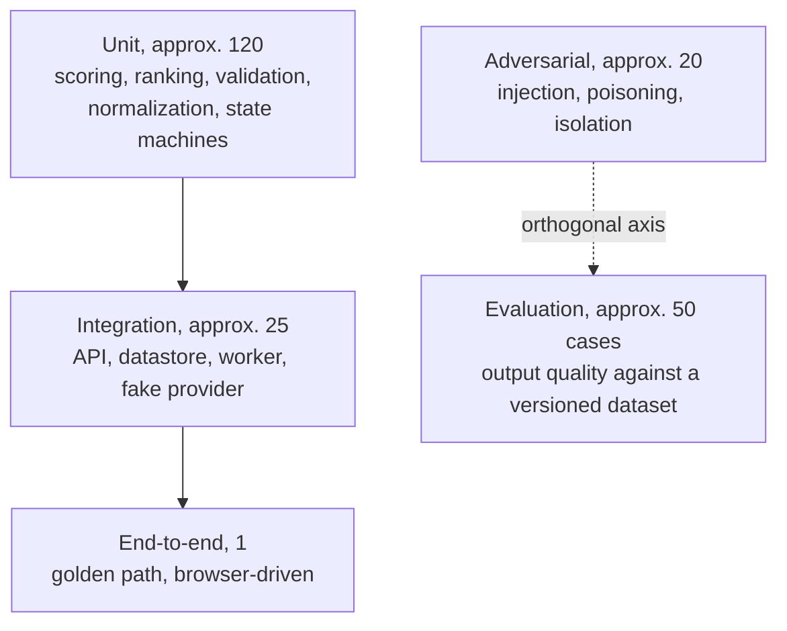
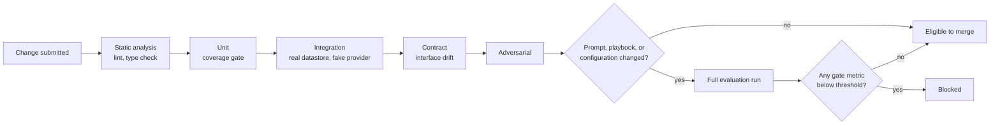

# Software Test Plan

| Field | Value |
|---|---|
| Document ID | NOVA-STP-001 |
| Version | 0.1 |
| Status | Draft |
| Owner | Laxmi Poudel |
| Date | 2026-09-08 |
| Conforms to | ISO/IEC/IEEE 29119-3:2021, clause 7 |

---

## 1. Introduction

### 1.1 Scope

This plan covers all verification and validation activity for the initial release of NOVA. It
addresses two distinct concerns which are deliberately kept separate:

| Concern | Question answered | Nature | Frequency |
|---|---|---|---|
| Software testing | Does the code behave as specified? | Deterministic, pass or fail | Every commit |
| Agent evaluation | Is the generated output of acceptable quality? | Statistical, threshold-based | On configuration change and on demand |

Conflating the two produces an unstable pipeline and metrics that cannot be acted upon. Separation is
what permits the regression gate to be trusted. A gate that fails for reasons the engineer cannot
act upon is disabled in practice, and a disabled gate is worse than no gate because it presents as
protection.

Out of scope: performance testing beyond the latency measurements defined in section 5.5; testing of
the inference runtime itself; testing of any post-initial-release capability.

### 1.2 References

| Reference | Title |
|---|---|
| NOVA-SRS-001 | Software Requirements Specification |
| NOVA-SAD-001 | Software Architecture Document |
| NOVA-TM-001 | Threat Model |
| NOVA-RR-001 | Risk Register |
| ISO/IEC/IEEE 29119-3:2021 | Software testing, test documentation |

### 1.3 Glossary

See [NOVA-SRS-001 section 1.4](srs.md#14-definitions-acronyms-and-abbreviations).

## 2. Context of the testing

### 2.1 Project

Single-engineer project, approximately 130 to 180 hours, delivered across seven milestones. Testing
is not a milestone; it is concurrent with implementation and gated in continuous integration.

### 2.2 Test items

| Item | Version under test |
|---|---|
| API service | Per commit |
| Worker and agent orchestration | Per commit |
| Memory subsystem: extraction, validation, storage, retrieval, lifecycle | Per commit |
| Strategy selection | Per commit |
| Web application | Per commit |
| Database schema and migrations | Per commit |
| Prompt and configuration versions | On change, via the evaluation gate |
| Deployment composition | Per release |

### 2.3 Test scope

**Included.** All requirements of priority Must in NOVA-SRS-001. All quality scenarios QS-1 to QS-9
in NOVA-SAD-001. All threats T1 to T10 in NOVA-TM-001.

**Excluded, with rationale.**

| Excluded | Rationale |
|---|---|
| Load and stress testing | Single user, single concurrent task. No meaningful load profile exists |
| Compatibility testing across browsers | One user, one browser. Stated as a limitation rather than tested |
| Localization testing | Single locale |
| Accessibility conformance audit | Not claimed. Basic semantic markup and screen-reader-associated form errors are required by NFR, but no conformance level is asserted |
| Inference runtime internals | Third-party dependency, addressed through contract tests at its boundary |

### 2.4 Assumptions and constraints

| ID | Assumption or constraint | Effect on testing |
|---|---|---|
| TA-1 | A fixed random seed renders local inference sufficiently reproducible | If false, run-over-run comparison and the regression gate both become unreliable. Verified early |
| TA-2 | Approximately 50 evaluation cases yield sufficient signal for gating | If false, the dataset is enlarged. Thresholds are not loosened |
| TA-3 | Deterministic checks capture sufficient quality signal | If false, the share of model-based review increases and the reliability caveat is documented |
| TC-1 | No external reviewer is available | Automated gates substitute for peer review where they can. The limitation is recorded, not concealed |
| TC-2 | Evaluation suite duration must remain within the continuous integration budget | Constrains dataset size and the frequency of the expensive gate |
| TC-3 | Evaluation data is synthetic and open-source only | The dataset is committable and reviewable |

### 2.5 Stakeholders

| Stakeholder | Interest in testing |
|---|---|
| Implementing engineer | Defect detection, regression prevention, confidence to refactor |
| Technical reviewer | Evidence that quality control is enforced rather than asserted |

## 3. Testing communication

Single-engineer project. Defects are recorded as repository issues with a severity classification.
Continuous integration results are the primary communication channel. Evaluation run results are
persisted and trended over time.

The manual exploratory session findings in section 6.2 are recorded as issues rather than corrected
silently, so that the record of systematic testing is itself an artifact.

## 4. Risk register

### 4.1 Product risks

| ID | Risk | Likelihood | Impact | Mitigating test activity |
|---|---|---|---|---|
| PR-1 | Cross-tenant data disclosure | Low | Critical | Isolation suite as an unconditional gate from the first milestone in which memory exists |
| PR-2 | An injected instruction persists into stored memory | Medium | High | Adversarial scenarios targeting the extraction and confirmation path specifically, not only the generation prompt |
| PR-3 | Adversarial feedback alters strategy selection | Low | Medium | Poisoning scenarios asserting score clamping and that no single event alters a selection |
| PR-4 | A memory deletion does not take effect | Low | High | Deletion completeness test asserting both non-retrievability and absence from subsequent prompts |
| PR-5 | A configuration change degrades output without detection | Medium | High | Regression gate demonstrated against a deliberately degraded prompt version |
| PR-6 | Retrieval silently returns nothing and the system appears healthy | Medium | High | Explicit failure required on embedding unavailability. Asserted by test |
| PR-7 | A failed task leaves no diagnostic record | Medium | Medium | Trace completeness test executed against a deliberately failed task |

### 4.2 Project risks

| ID | Risk | Mitigating activity |
|---|---|---|
| PJ-1 | Evaluation dataset construction is underestimated | Authoring begins two milestones before the dataset is required. Twenty cases already exist from the model selection spike |
| PJ-2 | Inference nondeterminism destabilizes the gate | Run-over-run variance measured before any threshold is set |
| PJ-3 | Test effort is displaced by feature work under schedule pressure | Isolation tests and the regression gate are excluded from the pre-committed scope reduction order |

## 5. Test strategy

### 5.1 Sub-processes

| Sub-process | Objective | Entry criteria | Exit criteria |
|---|---|---|---|
| Unit | Verify logic in isolation | Component implemented | All pass. Statement coverage at least 80% on memory, retrieval, scoring, and validation logic |
| Integration | Verify component interaction and persistence | Unit tests passing, schema migrated | All pass against a real datastore and a fake inference provider |
| End-to-end | Verify the primary user journey through the interface | Integration passing | The golden path completes |
| Adversarial | Verify security properties | Memory subsystem present | Zero failures. No tolerance |
| Evaluation | Quantify output quality and detect regression | Dataset versioned, baseline established | No gate metric below its threshold |

### 5.2 Test design techniques

| Technique | Applied to |
|---|---|
| Equivalence partitioning and boundary value analysis | Requirement length limits, score clamping bounds, exploration rate bounds, confidence floors |
| State transition testing | Task state machine, memory lifecycle, configuration version states, job lease and reclamation |
| Decision table testing | Feedback normalization across event types; retrieval inclusion given scope, tenant, pin, and threshold |
| Error guessing and exploratory testing | Manual charter sessions, section 6.2 |
| Fault injection | Worker termination mid-task, inference provider unavailability, datastore unavailability, poison job |
| Security testing | Injection, privilege and isolation, feedback poisoning, output handling |
| Contract testing | Interface description drift; both inference provider implementations against a shared suite |

Unit testing is where coverage is measured, because it is where the logic resides. The scoring
functions written for the model selection spike already carry an assertion-based self-test,
established before those functions were trusted with real output.

Integration testing uses a fake inference provider deliberately. These tests exist to verify wiring
and must therefore be fast and deterministic. Model behaviour belongs to the evaluation
sub-process. Combining the two yields a slow suite failing for reasons that cannot be acted upon.

End-to-end testing is confined to a single path. Such tests are expensive to maintain and the
product is a single-user local application.

### 5.3 Test deliverables

| Deliverable | Form |
|---|---|
| Automated test suites | Source, in the repository |
| Evaluation dataset | Versioned by content hash, in the repository |
| Adversarial scenario definitions | Declarative configuration, in the repository |
| Evaluation run records | Persisted rows with per-metric aggregates and a gate verdict |
| Defect records | Repository issues with severity |
| Exploratory session notes | Repository issues |
| This plan | NOVA-STP-001 |

### 5.4 Test data requirements

| Requirement | Detail |
|---|---|
| Composition | Approximately 50 cases, stratified across the four requirement types |
| Origin | Approximately 30 hand-authored, approximately 20 derived from open-source issue trackers and public specifications |
| Content per case | Requirement text, requirement type, expected properties (required case types, enumerated acceptance criteria, must-not-contain assertions), and labelled relevant memories for retrieval scoring |
| Held-out portion | A reserved subset never used for prompt tuning, so that the evaluation set does not become a tuning set |
| Versioning | Content hash. Any edit produces a new version. Comparison across versions is refused by the tooling |
| Sensitivity | Synthetic and open-source only. Committable and reviewable |

Twenty cases already exist, produced for the model selection spike, five per requirement type, each
with four machine-checkable acceptance criteria. They transfer directly and remove approximately one
third of the authoring effort.

The hand-authored majority is deliberate. Derived cases contribute realism, but only hand-authored
cases permit expected properties to be stated precisely enough for deterministic scoring. Where a
metric must carry meaning, precision is worth more than realism.

### 5.5 Metrics to be collected

Each metric carries a definition, a collection method, a threshold, and a stated limitation. No
measured value exists for most. Every threshold below is provisional.

| ID | Metric | Definition | Threshold | Limitation |
|---|---|---|---|---|
| M1 | Task success rate | completed ÷ (total − user cancelled) | ≥95% | Carries no quality information. A completed poor plan counts as success. Not to be quoted as a quality figure |
| M2 | Structured output validity | valid on first attempt ÷ total generations. Also reported after repair | ≥98% first attempt | Measures structure only. Observed 12 of 12 over a 12-generation sample, which is far too small to establish a rate |
| M3 | Acceptance criteria coverage | criteria with at least one linked case ÷ total criteria | ≥90% | Requires machine-parseable criteria. Relies on the model's own linking, so it is an upper bound |
| M4 | Required case type presence | mean over plans of types present ÷ types required | ≥85% | Relies on the model's own case type labelling. A mislabelled case inflates the figure. Periodic manual audit required |
| M5 | Duplicate case rate | cases exceeding within-plan cosine similarity θ ÷ total cases | ≤10% | θ is arbitrary and must be fixed and documented. Legitimately similar cases may be flagged |
| M6 | Correction Recurrence Rate | confirmed corrections recurring as errors on later structurally similar tasks ÷ total confirmed corrections | ≤20% | Wholly dependent on the structural similarity threshold. Cannot distinguish a memory retrieved and disregarded from one never retrieved. Always reported alongside M7 |
| M7 | Retrieval precision and recall at 5 | against the labelled relevance set | ≥70% / ≥60% | Labels represent one engineer's judgment over a small set. Relevance is partly subjective |
| M8 | Evaluation pass rate | cases passing every gate ÷ total cases | ≥85% | Bounded by dataset breadth. A narrow dataset yields a flattering figure |
| M9 | Provider call failure rate | failed calls ÷ total calls | ≤2% | Local failures are predominantly environmental, so this tracks environment health more than code health |
| M10 | Latency percentiles | 50th, 95th, 99th, end to end and per step | Set from data | Meaningless without stating GPU, model, and quantization. Cold model load reported separately: one measurement showed 115 s cold against 18 to 21 s warm for the same model |
| M11 | Resource cost per task | tokens and elapsed time locally; billed cost for hosted providers | Not applicable locally | Local inference carries no marginal token cost. A monetary figure would be fabricated |
| M12 | Regression rate | cases passing in run N−1 and failing in run N ÷ cases passing in run N−1 | ≤5% | Comparable only within a dataset version. Sensitive to nondeterminism, mitigated by a fixed seed, with residual variance measured before thresholds are set |

M6 is the primary metric. It renders the project's central claim falsifiable and is reported
including any run in which it deteriorates.

### 5.6 Test completion criteria

| Sub-process | Completion criterion |
|---|---|
| Unit | All pass. Statement coverage at least 80% on memory, retrieval, scoring, and validation logic |
| Integration | All pass, including worker termination, lease reclamation, poison job, and failed-task trace persistence |
| End-to-end | The golden path completes through the interface |
| Adversarial | Zero failures. Cross-tenant isolation admits no tolerance |
| Evaluation | No gate metric below threshold. M6 measured across at least two runs on a fixed dataset version |

Release acceptance additionally requires: a deliberately degraded prompt version demonstrably blocked
by the gate; deployment from a clean checkout on a separate host; and a completed restore drill.

### 5.7 Test environment requirements

| Environment | Composition |
|---|---|
| Development | Local. Real datastore in a container, fake inference provider |
| Continuous integration | Ephemeral datastore container. Fake provider for integration; pinned real model for evaluation |
| Evaluation | Pinned model version, fixed seed, **separate datastore instance**. The evaluation harness must never share a datastore with a working instance |

The reference configuration for every timing measurement is: NVIDIA RTX 4050 Laptop, 6 GB VRAM,
4B-parameter model at 4-bit quantization, 8192-token context, inference runtime on the host.
Measurements are void without this qualification.

### 5.8 Retesting and regression testing

| Gate | Blocks merge |
|---|---|
| Static analysis, unit, integration, contract | Yes |
| Adversarial suite, any failure | Yes, unconditionally |
| Cross-tenant isolation | Yes, unconditionally |
| Full evaluation run | Only where prompts, playbooks, or configuration changed |
| Any gate metric below threshold | Yes |

The expensive gate executes only where it can produce information. Thresholds derive from measured
variance rather than from intent; that measurement does not yet exist and is a prerequisite recorded
in [NOVA-SDP-001](sdp.md).

Every defect of severity S1 or S2 receives a failing test before the corrective change. For defects
of output quality, the regression test is a new evaluation case added to the dataset, which is how
the dataset accrues coverage rather than being authored once and left static.

### 5.9 Suspension and resumption criteria

| Condition | Action |
|---|---|
| Cross-tenant disclosure observed | Suspend feature work. Correct, add a regression test, resume |
| Regression gate observed to flap | Suspend reliance on the gate. Measure variance, reset thresholds, resume |
| Evaluation dataset edited without a version increment | Suspend trend reporting until the version is corrected |
| Inference environment altered | Suspend cross-run comparison until a new baseline is established |

## 6. Testing activities and estimates

### 6.1 Automated activity

| Activity | Milestone | Estimate |
|---|---|---|
| Unit suites, developed alongside implementation | M2 to M5 | Included in feature estimates |
| Integration suite | M2 to M3 | 6 h |
| Isolation suite | M3 | 3 h |
| End-to-end path | M3 | 2 h |
| Evaluation dataset authoring | M2 to M5 | 15 to 25 h |
| Evaluation harness and metric computation | M5 | 10 h |
| Adversarial scenario suite | M5 | 6 h |
| Continuous integration configuration and gating | M2, M5 | 4 h |

### 6.2 Manual activity

Charter-based, time-boxed to approximately 60 minutes each. Automation does not detect everything.

| Charter | Objective |
|---|---|
| Authentic usage | Operate NOVA on genuine requirements from personal work. Record every point of friction |
| Memory management | Deliberately construct contradictory, overlapping, and nonsensical memories. Observe system behaviour |
| Trace comprehension | Present the trace viewer to a reader unfamiliar with the system. Determine whether they can explain what occurred. If they cannot, the observability provision is decorative |
| Manual adversarial | Attempt injections the automated suite does not cover |
| Cold start | Fresh database. Assess whether a first-time experience is coherent |
| Failure presentation | Terminate the inference runtime mid-task. Assess whether the resulting error is actionable |

### 6.3 Production-like validation

No production environment exists. The nearest equivalents, described as such:

- Deployment from a clean checkout on a separate host or virtual machine, which detects the class of
  defect that appears only in the absence of accumulated development-machine state
- Sustained run of at least 50 sequential tasks, monitoring memory growth, trace volume, and
  retrieval degradation
- Restore drill from backup
- Reproducibility check: identical seed, model version, and configuration version yielding equivalent
  output. Should this fail, every regression comparison is noise

## 7. Staffing

| Role | Held by | Responsibilities |
|---|---|---|
| Test manager | Laxmi Poudel | This plan, gate definitions, threshold setting |
| Test designer and implementer | Laxmi Poudel | Suite construction, dataset authoring, scenario definition |
| Test executor | Continuous integration, plus the engineer for manual charters | Execution, result recording |

No hiring or training need arises. The single-reviewer limitation is recorded as project risk PJ-3
and as constraint TC-1.

## 8. Schedule

| Milestone | Testing activity | Gate introduced |
|---|---|---|
| M1 | Spike harness self-test | None |
| M2 | Unit and integration suites, contract test, initial dataset cases | Static analysis, unit, integration, contract |
| M3 | Isolation suite, deletion completeness, end-to-end path, extraction precision measurement | Isolation, unconditional |
| M4 | Selection determinism and poisoning scenarios | Included in the adversarial suite |
| M5 | Full dataset, evaluation harness, adversarial suite, variance measurement, threshold setting | Adversarial and evaluation regression gate |
| M6 | Fault injection for every degraded mode, soak run, restore drill, clean-checkout deployment | Log content assertion |
| M7 | Documentation accuracy pass, tracing every stated claim to a test, metric, or decision record | None |

## 9. Defect classification

| Severity | Definition | Response |
|---|---|---|
| S1 | Data loss, cross-tenant disclosure, unbounded resource consumption | Suspend feature work. Correct, add a regression test, resume |
| S2 | Primary workflow inoperable | Correct within the current milestone |
| S3 | Degraded quality or confusing presentation | Backlog with a recorded issue |
| S4 | Cosmetic | Backlog. May remain uncorrected |

---

## Revision history

| Version | Date | Author | Change |
|---|---|---|---|
| 0.1 | 2026-09-08 | Laxmi Poudel | Initial draft |
