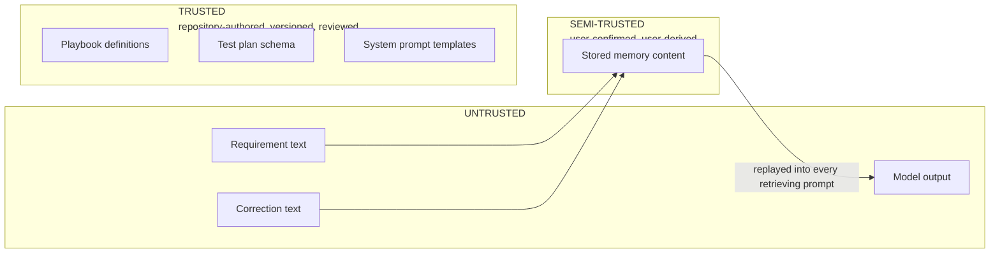

# Threat Model

| Field | Value |
|---|---|
| Document ID | NOVA-TM-001 |
| Version | 0.1 |
| Status | Draft |
| Owner | Laxmi Poudel |
| Date | 2026-09-08 |
| Method | STRIDE, applied per data flow diagram element |

---

## 1. Scope

This document analyses the initial release of NOVA: a locally deployed, single-user system with a
multi-tenant-capable data model, no authentication, and no outbound network dependency beyond a
host-resident inference runtime.

Controls are separated into those implemented for this release and those a production deployment
would additionally require. Asserting production-grade security for a local single-user application
would itself be a defect in this document.

**Not claimed.** This analysis does not assert conformance to any control framework. It does not
claim that prompt injection is prevented, only that its blast radius is architecturally bounded.

## 2. System description

NOVA accepts natural-language requirements, generates structured test plans under schema constraint,
and stores rules derived from user corrections. Stored rules are retrieved and injected into
subsequent generation prompts.

The property that dominates this analysis: **a stored memory is replayed into every future prompt
that retrieves it.** A compromise of the memory path is persistent, not transient.

Architecture: [NOVA-SAD-001](architecture.md).

## 3. Assets

| ID | Asset | Sensitivity | Rationale |
|---|---|---|---|
| A-1 | Stored memories | High | Determine all future output. Compromise persists across every subsequent task |
| A-2 | Prompt and configuration versions | High | Control system behaviour directly |
| A-3 | Hosted provider credentials | High | Financial exposure and a data egress path |
| A-4 | Requirement text | Medium, High with authentic data | May describe unreleased functionality |
| A-5 | Execution traces | Medium | Contain prompt context and retrieved memory content |
| A-6 | Feedback events | Medium | The authoritative learning record. Corruption propagates to every derived score |
| A-7 | Evaluation dataset | Low | Public by design |

## 4. Trust boundaries

| Boundary | Crossing | Control |
|---|---|---|
| TB-1 | Browser to API service | Schema validation on every field. Tenant resolved server-side and never accepted from the client |
| TB-2 | Untrusted text into a generation prompt | Delimited and labelled as data. Never concatenated into instruction context |
| TB-3 | Model output into persistence or presentation | Schema conformance, then semantic validation, then escaping on render |
| TB-4 | Correction text into durable memory | **The highest-risk crossing.** Mechanical screen, then mandatory human confirmation |
| TB-5 | Tenant to tenant | Scoping applied at the data access layer, not at call sites |
| TB-6 | Host to network | Local inference by default. A hosted provider is reachable only through an explicit user action |

## 5. Threat enumeration

Threats are enumerated per STRIDE category and mapped to the boundary they cross.

### 5.1 Spoofing

| ID | Threat | Boundary | Assessment |
|---|---|---|---|
| T1 | A client asserts a tenant identity it does not hold | TB-1, TB-5 | Mitigated. The tenant identifier is resolved server-side and never read from a request body, header, or parameter |
| T2 | An actor impersonates the legitimate user | TB-1 | **Accepted.** No authentication exists in this release. The service binds to the loopback interface and the threat model assumes host access equates to user access. Authentication is required before any multi-user deployment |

### 5.2 Tampering

| ID | Threat | Boundary | Assessment |
|---|---|---|---|
| T3 | **Persistent injection through stored memory.** Correction text shaped as a system instruction survives extraction, is confirmed, and is thereafter replayed into every retrieving prompt | TB-4 | Mitigated by two independent controls in series, and by the absence of any capability to misuse. See section 6.1. **Highest-impact threat in the system** |
| T4 | Injection through requirement text redirects generation | TB-2 | Mitigated. Delimited and labelled untrusted blocks, constrained decoding bounding the output shape, output validation |
| T5 | Adversarial feedback alters strategy selection | TB-1 | Mitigated. Bounded update step, clamped score range, minimum observation threshold, per-tenant score isolation. No single event can alter a selection |
| T6 | Model output containing markup, path traversal, or query-shaped text is interpreted rather than treated as data | TB-3 | Mitigated. Schema conformance, semantic validation, parameterized queries only, escaping on render |
| T7 | Direct modification of the datastore | Host | **Accepted.** Host access is assumed equivalent to user access in a local deployment |

### 5.3 Repudiation

| ID | Threat | Boundary | Assessment |
|---|---|---|---|
| T8 | The origin of a stored memory cannot be established | TB-4 | Mitigated. Provenance recorded against every memory: originating task, correction, timestamp. Feedback events are immutable and retained independently of any memory derived from them |
| T9 | A configuration change cannot be attributed or reconstructed | TB-1 | Mitigated. Versioned configuration records, retained on supersession, each activation linked to its evaluation run |

### 5.4 Information disclosure

| ID | Threat | Boundary | Assessment |
|---|---|---|---|
| T10 | **Cross-tenant disclosure** through an unscoped query or an insecure direct object reference | TB-5 | Mitigated. Scoping applied at the data access layer such that no query path can omit it. Verified by an unconditional gate. **Admits no tolerance** |
| T11 | Requirement or memory content is transmitted off-host through a provider change | TB-6 | Mitigated. Provider change requires explicit user action and never occurs as a fallback. The active provider is displayed in the interface |
| T12 | Content is disclosed through application logs | Host | Mitigated. Identifiers and prompt digests only. Content logging exists solely as an explicit debug mode, and its absence is asserted by test |
| T13 | Deleted memory content is recoverable from historical traces | TB-4 | Mitigated. Traces store prompt digests, not prompt text. Deletion purges content and retains only a tombstone |
| T14 | Credentials are disclosed through the repository or logs | Host | Mitigated. Environment file excluded from version control, secret scanning enabled. The default configuration requires no credential |

### 5.5 Denial of service

| ID | Threat | Boundary | Assessment |
|---|---|---|---|
| T15 | An oversized requirement exhausts context or memory | TB-1 | Mitigated. Input length caps, context budget guard reducing retrieved memory before requirement content |
| T16 | A repeatedly failing job consumes resources without bound | Internal | Mitigated. Bounded attempt count, then terminal failure. Every retry loop bounded with a defined terminal state |
| T17 | Unbounded memory growth degrades retrieval | Internal | Mitigated. Near-duplicate detection, confidence decay, archival below a floor, per-tenant cap |
| T18 | Unbounded trace growth consumes storage | Internal | **Accepted for this release.** No pruning policy exists. Recorded as technical debt rather than discovered later |

### 5.6 Elevation of privilege

| ID | Threat | Boundary | Assessment |
|---|---|---|---|
| T19 | An injected instruction causes the model to take an action beyond generating text | TB-2, TB-4 | **Mitigated architecturally.** The model has no tool surface: no shell, no filesystem, no network capability. A successful injection can produce a poor test case. It cannot take an action, because no action exists |
| T20 | A configuration version is activated without evaluation | TB-1 | Mitigated. Activation without a linked passing evaluation run is rejected at the data layer, not merely in the interface. An interface-only check is advisory |
| T21 | A malicious dependency executes code | Supply chain | Partially mitigated. Pinned versions with a lockfile, automated advisories, dependency audit in continuous integration, base images pinned by digest. Deliberate minimization of dependency count |

## 6. Mitigations

### 6.1 The memory path, in detail

Threat T3 receives disproportionate treatment because its impact is persistent.

| Layer | Control | Known weakness |
|---|---|---|
| 1 | Length bound on candidate rule text | Bounds payload size only |
| 2 | Generality, actionability, and scope-soundness checks | Rejects malformed candidates, not adversarial ones |
| 3 | Instruction-shape screen | A denylist against an open-ended attack surface. **Will miss cases** |
| 4 | Near-duplicate and conflict detection | Surfaces contradiction, does not detect intent |
| 5 | **Mandatory human confirmation** | Depends on the user reading the candidate. Degrades under high volume |
| 6 | **No tool surface** | The strongest layer, and architectural rather than filter-based |
| 7 | Adversarial regression suite | Establishes a floor, not a guarantee |

Layers 3 and 5 are deliberately paired. Layer 3 is known to be incomplete, which is precisely why
layer 5 exists behind it. Treating either as sufficient would be an error.

Layer 6 is what bounds the consequence. Absent a tool surface, the worst outcome of a successful
injection is a poor test case that a human reviews.

### 6.2 Permission model

| Principal | Capability |
|---|---|
| Web application | Only what the API exposes. No direct datastore access |
| API service | Datastore read and write within its tables. Inference gateway |
| Worker | Same datastore scope. Inference gateway. **No inbound listener** |
| The inference model | **None.** Generates text into a schema. Cannot read files, execute commands, or initiate network requests |
| Evaluation harness | A separate datastore instance. Never touches working data |

The absence of a tool surface is a designed property, not an unimplemented feature. Introducing one
later would require a permission model, sandboxing, and an approval flow, which is why such
capabilities are excluded from this release.

### 6.3 Input and output validation

| Boundary | Control |
|---|---|
| API inbound | Typed models, length caps, enumerated constraints, unknown fields rejected |
| Requirement text | Length cap tied to the context budget, encoding normalization |
| Correction text | Length cap, instruction-shape screen |
| Model output | Schema conformance, semantic checks, referential integrity of criterion links |
| Memory content | Validation screen before proposal, human confirmation before storage |
| Rendered output | Framework escaping. No unsanitized markup |
| Datastore | Parameterized queries exclusively |

### 6.4 Tenant isolation

The single guarantee admitting no tolerance.

- Tenant identifier present on every user-owned relation
- Scoping applied at the data access layer, so isolation does not depend on any caller remembering
- Tenant resolved server-side, never from a client-supplied value
- No endpoint returns an object without a scope check
- The isolation suite is an unconditional gate from the milestone in which memory first exists,
  before a second tenant is ever created, because the test is what preserves the guarantee as the
  code grows
- With authentication, row-level security is added as defence in depth

## 7. Residual risk

| ID | Residual risk | Rationale for acceptance |
|---|---|---|
| RR-1 | Prompt injection is bounded, not prevented | The threat class is unsolved industry-wide. The defensible claim is architectural: the agent possesses no capability to misuse. The adversarial suite establishes a floor, not a guarantee |
| RR-2 | No authentication exists | Single-user local deployment bound to loopback. Host access is assumed equivalent to user access. Required before any multi-user deployment |
| RR-3 | Personally identifiable information is not detected | The release processes synthetic and open-source data only. **This status changes should authentic data enter the system**, at which point detection becomes a requirement rather than a gap |
| RR-4 | No encryption at rest | Local disk, synthetic data. Volume and column-level encryption required for production |
| RR-5 | Trace growth is unbounded | Acceptable at single-user scale. Recorded as technical debt |
| RR-6 | Memory conflict resolution is manual | Does not scale beyond a moderate memory count. Acceptable at expected volume |
| RR-7 | Persistent injection defences are unproven | Novel threat with no established benchmark. The adversarial suite is the only evidence and is described as such |

## 8. Assumptions

| ID | Assumption | Consequence if false |
|---|---|---|
| SA-1 | Host access is equivalent to legitimate user access | The absence of authentication becomes exploitable |
| SA-2 | The instruction-shape screen catches enough to keep human review tractable | Review fatigue degrades the effectiveness of layer 5 |
| SA-3 | Data remains synthetic and open-source | Personally identifiable information detection becomes mandatory |
| SA-4 | No tool capability is introduced | **This entire document requires rewriting rather than amendment** |
| SA-5 | Services remain bound to the loopback interface | Network exposure introduces threats not analysed here |

## 9. Controls by release

| Control | Initial release | Production would require |
|---|---|---|
| Authentication | Stubbed, single user | Federated identity or session authentication, multi-factor |
| Authorization | Data-layer scoping | Additionally row-level security in the datastore |
| Rate limiting | Documented, middleware seam present | Enforced per-tenant token bucket, tighter on inference-invoking endpoints |
| Personally identifiable information | Not detected. Recorded gap | Detection with redaction before storage |
| Encryption at rest | None | Volume encryption plus column-level for sensitive fields |
| Secret management | Environment file | Managed secret store |
| Audit | Application-level append-only | Additionally tamper-evident storage |
| Backup | Manual, drilled once | Scheduled, offsite, point-in-time recovery |
| Monitoring | Local tracing | Alerting, service objectives, on-call rotation |

## 10. Verification

Every threat maps to a test. The mapping is maintained in
[NOVA-STP-001 section 4.1](test-plan.md#41-product-risks).

| Threat group | Verification |
|---|---|
| T1, T10 | Isolation suite as an unconditional gate. Insecure direct object reference attempts against every identifier-bearing endpoint |
| T3 | Adversarial scenarios targeting extraction and confirmation specifically: instruction-shaped corrections, oversized rules, rules crafted to suppress required case types |
| T4 | Adversarial scenarios against the generation prompt: direct instruction, instructions concealed within acceptance criteria, role-play framing, encoded payloads |
| T5 | Poisoning scenarios asserting score clamping and that no single event alters a selection |
| T6 | Output handling scenarios: markup, traversal strings, query-shaped text, oversized fields |
| T12 | Automated assertion that no content field appears in log output |
| T13 | Deletion completeness test asserting non-retrievability and absence from subsequent prompts |
| T15, T16 | Fault injection: oversized requirement, poison job, provider unavailability |
| T20 | Attempted activation of an unevaluated configuration version, expecting rejection |
| T21 | Dependency audit in continuous integration |

## 11. Environmental notes

| Note | Detail |
|---|---|
| Service binding | Loopback only. No reason exists to expose a local single-user application to a network segment |
| Host inference | The inference runtime is host-resident rather than containerized. GPU passthrough on this platform adds operational friction without benefit. The container-to-host path requires verification and documentation |
| GPU contention | Endpoint protection software on the development workstation holds GPU memory, reducing available VRAM below nominal. Recorded so that measurements taken here remain interpretable elsewhere |

---

## Revision history

| Version | Date | Author | Change |
|---|---|---|---|
| 0.1 | 2026-09-08 | Laxmi Poudel | Initial draft |
