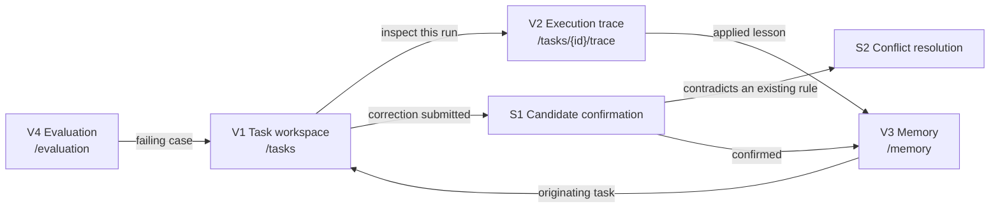

# User Interface Design

| Field | Value |
|---|---|
| Document ID | NOVA-UI-001 |
| Version | 0.1 |
| Status | Draft |
| Owner | Laxmi Poudel |
| Date | 2026-09-08 |
| Conforms to | Project convention. Screen inventory and low-fidelity wireframes |

---

## 1. Purpose and scope

[NOVA-SRS-001 section 3.4.1](srs.md#341-user-interfaces) names four views and says nothing further
about them. This document closes gap G3 in [NOVA-SDP-001 section 5.6](sdp.md#56-entry-criteria-for-implementation)
by fixing what each view contains, which requirement each element serves, and what each view shows
when things go wrong.

Two of these views carry the project's explanatory value. The trace viewer is the evidence that the
system can be inspected rather than trusted, and the applied-lessons panel is the evidence that
memory is doing anything at all. A demonstration in which neither is legible has nothing to show.

**In scope.** Screen inventory, layout structure, element-to-requirement traceability, state
coverage including every exception condition in [NOVA-SRS-001 section 3.5.2](srs.md#352-exception-operation),
and navigation.

**Out of scope.** Visual design, typography, colour, component library selection, and copy. Those are
implementation decisions and are not load-bearing for any requirement.

Wireframes are deliberately low-fidelity ASCII. They are diffable, they survive document generation,
and they cannot be mistaken for a finished design.

## 2. Screen inventory

| ID | View | Route | Purpose | Primary requirements |
|---|---|---|---|---|
| V1 | Task workspace | `/tasks`, `/tasks/{id}` | Submit a requirement, watch it execute, read the plan, record feedback | FR-1, FR-2, FR-5, FR-4.4, NFR-7, NFR-8 |
| V2 | Execution trace | `/tasks/{id}/trace` | Show every step, score, model call, and check verdict behind one plan | FR-8 to FR-8.4 |
| V3 | Memory management | `/memory`, `/memory/{id}` | Browse, filter, edit, pin, delete, and export stored rules | FR-7 to FR-7.7 |
| V4 | Evaluation results | `/evaluation` | Report metrics per run, and show the gate blocking a configuration | FR-9, FR-9.1, FR-9.2, FR-10.1 |

Two surfaces are not separate views but are called out because they carry requirements of their own:

| ID | Surface | Host view | Purpose | Primary requirements |
|---|---|---|---|---|
| S1 | Candidate confirmation | V1 | Approve, edit, or discard a rule derived from a correction | FR-6.1 to FR-6.4, FR-6.7 |
| S2 | Conflict resolution | S1 | Present a candidate and the in-scope memory it contradicts | FR-6.5, OP-4 |

### 2.1 Navigation



Every navigation edge is bidirectional in practice through the browser's own history. No view is
reachable only from one other view.

## 3. Persistent frame

Present on every view.

```
+----------------------------------------------------------------------------------+
| NOVA        Tasks    Memory    Evaluation           provider: local * gemma3:4b  |
+----------------------------------------------------------------------------------+
|                                                                                  |
|  [ view body ]                                                                   |
|                                                                                  |
+----------------------------------------------------------------------------------+
```

The provider indicator satisfies FR-11.2 and is a permanent element rather than a settings-page
detail, because "did this leave my machine" is a question a user should never have to navigate to
answer. It states the provider and the model. Where the provider is not local it is stated in words,
never by absence or by colour alone.

## 4. V1. Task workspace

### 4.1 Submission

```
+----------------------------------------------------------------------------------+
| New task                                                                         |
|                                                                                  |
| Requirement type   [ API / CRUD endpoint            v ]                          |
|                                                                                  |
| Requirement                                                                      |
| +------------------------------------------------------------------------------+ |
| | As an admin, I can delete a user account via DELETE /users/{id}.             | |
| |                                                                              | |
| | AC1: ...                                                                     | |
| +------------------------------------------------------------------------------+ |
|                                                    1,284 / 8,000 characters      |
|                                                                                  |
| Supplementary context (optional)                                                 |
| +------------------------------------------------------------------------------+ |
| |                                                                              | |
| +------------------------------------------------------------------------------+ |
|                                                                                  |
|                                                            [ Generate plan ]     |
+----------------------------------------------------------------------------------+
```

The character counter is present before submission rather than after, because FR-1.1 rejects an
over-length requirement and a limit discovered by rejection is a limit discovered too late.

### 4.2 Execution

Submission returns a task identifier without waiting (section 3.5.1 step 2), so this state is
reached immediately and is polled.

```
+----------------------------------------------------------------------------------+
| Task 0f3a  ·  Delete user  ·  RUNNING                             [ Cancel ]     |
|                                                                                  |
|  Queued 14:02:11  ->  Running 14:02:12  ->  step 3 of 5: generating              |
|                                                                                  |
|  retrieval    done    3 memories applied, 1 excluded below threshold             |
|  selection    done    playbook "endpoint-standard"                               |
|  generation   ...     attempt 1                                                  |
|  checks       -                                                                  |
|  review       -                                                                  |
|                                                                                  |
|                                                    [ Inspect trace so far ]      |
+----------------------------------------------------------------------------------+
```

Status is a word, not a colour or a spinner alone (NFR-7). Cancel is present for the whole of the
running state and preserves the partial trace (NFR-8, OP-9). The trace is reachable while the task
is still running, because a task that hangs is exactly when its trace is most wanted (FR-8.3).

### 4.3 Results and feedback

```
+----------------------------------------------------------------------------------+
| Task 0f3a  ·  Delete user  ·  COMPLETE 24.1 s              [ View full trace ]   |
+----------------------------------------------------------------------------------+
| Applied lessons                                                                  |
|                                                                                  |
|  * Every endpoint needs an unauthenticated case expecting 401 and an             |
|    authenticated-but-forbidden case expecting 403.                               |
|      similarity 0.81  recency 0.62  confidence 0.90  ->  combined 0.79           |
|      from task 08c1, confirmed 2026-08-30                             [ Open ]   |
|                                                                                  |
|  * When an operation cascades to related records, assert their state too.        |
|      similarity 0.74  recency 0.55  confidence 0.70  ->  combined 0.68           |
|      from task 0a44, confirmed 2026-09-02                             [ Open ]   |
|                                                                                  |
|  1 memory was evaluated and excluded, scoring 0.31 against a 0.45 threshold.     |
|                                                                          [ Why ] |
|                                                                                  |
|  Playbook "endpoint-standard" selected on recorded outcomes.                     |
+----------------------------------------------------------------------------------+
| Plan  ·  6 cases  ·  schema v1                                                   |
|                                                                                  |
|  1  P0  happy     Admin deletes an existing user                                 |
|         covers AC1                              [ Accept ] [ Edit ] [ Reject ]   |
|                                                                                  |
|  2  P0  auth      Unauthenticated DELETE is refused                              |
|         covers AC1                              [ Accept ] [ Edit ] [ Reject ]   |
|                                                                                  |
|  ...                                                                             |
|                                                                    [ Add case ]  |
+----------------------------------------------------------------------------------+
| What was wrong with this plan? (optional)                                        |
| +------------------------------------------------------------------------------+ |
| |                                                                              | |
| +------------------------------------------------------------------------------+ |
|                                                              [ Submit feedback ] |
+----------------------------------------------------------------------------------+
```

Applied lessons sit **above** the plan. The ordering is deliberate: the claim this project makes is
that output changed because of a retained correction, and a reader who has to scroll past the output
to find the evidence will conclude the evidence was added afterwards.

Each lesson shows its component scores and its combined score, not a single opaque number
(FR-4.4). Excluded memories are stated with their score and the threshold they failed, because
FR-4.3 requires the exclusion to be recorded and a recorded exclusion the user cannot see is not an
explanation. Provenance is on the face of the lesson, not behind a hover.

Where the selection was exploratory, the playbook line says so in words (FR-3.4):

```
|  Playbook "endpoint-minimal" selected by exploration rather than by score.       |
|  Exploration is bounded at 10% of tasks.                                [ Why ]  |
```

## 5. S1. Candidate confirmation

Reached when a freeform correction produces candidates. Nothing is stored until the user acts
(FR-6.3).

```
+----------------------------------------------------------------------------------+
| From your correction, 2 candidate rules                                          |
|                                                                                  |
| Your words:                                                                      |
|   "you keep forgetting that deleting a user has to leave their projects alone"   |
|                                                                                  |
| +------------------------------------------------------------------------------+ |
| | 1. When an operation cascades to related records, assert the state of those  | |
| |    records afterwards, not only the primary resource.                        | |
| |                                                                              | |
| |    Scope  [ API / CRUD endpoint    v ]        applies to future tasks of     | |
| |                                                this type                     | |
| |                                                                              | |
| |    Similar to an existing rule (0.88). Confirming will reinforce that rule   | |
| |    rather than create a second one.                            [ Compare ]   | |
| |                                                                              | |
| |                              [ Confirm ]  [ Edit text ]  [ Discard ]         | |
| +------------------------------------------------------------------------------+ |
|                                                                                  |
| +------------------------------------------------------------------------------+ |
| | 2. Always reassign owned projects to the workspace owner.                    | |
| |                                                                              | |
| |    FLAGGED  This reads as an instruction to the system rather than a testing | |
| |    convention, and its scope is broader than the single correction it came   | |
| |    from. It will not be stored unless you confirm it explicitly.             | |
| |                                                                              | |
| |                              [ Confirm anyway ]  [ Edit text ]  [ Discard ]  | |
| +------------------------------------------------------------------------------+ |
|                                                                                  |
| Nothing is stored until you confirm it.                                          |
+----------------------------------------------------------------------------------+
```

The originating correction is shown verbatim above the candidates, because the user is being asked
whether the derivation is faithful and cannot judge that without the source.

The flagged state (FR-6.2) states *why* it is flagged. A warning without a reason trains the user to
click through it, which defeats the control. The affirmative button is labelled "Confirm anyway"
rather than "Confirm" so that the two paths are not muscle-memory identical.

The near-duplicate notice (FR-6.4) says what confirming will actually do, which is reinforce rather
than duplicate.

## 6. S2. Conflict resolution

Raised where a candidate contradicts an in-scope memory (FR-6.5, OP-4). The system does not choose.

```
+----------------------------------------------------------------------------------+
| These two rules conflict                                                         |
|                                                                                  |
|  EXISTING                            |  NEW CANDIDATE                            |
|  Boundary cases are P1.              |  Boundary cases are P0.                   |
|                                      |                                           |
|  confidence 0.85                     |  from your correction just now            |
|  from task 07b2, 2026-08-21          |  task 0f3a, 2026-09-08                    |
|  applied in 9 later tasks            |                                           |
|                                                                                  |
|  [ Keep existing, discard new ]   [ Replace: new supersedes existing ]           |
|  [ Keep both: narrow one of their scopes ]                                       |
|                                                                                  |
|  Replacing retains the superseded rule and links the two (FR-7.6).               |
+----------------------------------------------------------------------------------+
```

"Keep both" is offered because two rules that conflict at one scope frequently do not conflict once
one of them is narrowed, and forcing a choice between them would discard a correct rule.

## 7. V2. Execution trace

The view that makes the system inspectable rather than merely trusted.

```
+----------------------------------------------------------------------------------+
| Trace  ·  task 0f3a  ·  Delete user  ·  COMPLETE                  [ Back ]       |
| config version 14  ·  schema v1  ·  playbook endpoint-standard                   |
+----------------------------------------------------------------------------------+
|                                                                                  |
| 14:02:12  selection            2 ms                                              |
|           playbook "endpoint-standard", score 0.62 against 0.41 for              |
|           "endpoint-minimal". Not exploratory.                                   |
|                                                                                  |
| 14:02:12  retrieval          131 ms                                              |
|           4 candidates evaluated, 3 applied, 1 excluded                          |
|                                                                                  |
|           mem-0a1  sim 0.81  rec 0.62  conf 0.90  ->  0.79   applied             |
|           mem-04c  sim 0.74  rec 0.55  conf 0.70  ->  0.68   applied             |
|           mem-118  sim 0.66  rec 0.71  conf 0.55  ->  0.64   applied (pinned)    |
|           mem-0f9  sim 0.34  rec 0.40  conf 0.20  ->  0.31   below threshold     |
|                                                                                  |
| 14:02:12  generation       21,904 ms                                             |
|           attempt 1  ·  valid  ·  prompt 1,412 tok  ·  completion 918 tok        |
|           prompt digest sha256:9c1f...4ab2                                       |
|                                                                                  |
| 14:02:34  checks              14 ms                                              |
|           ac-coverage        pass   4 of 4                                       |
|           required-types     pass   4 of 4                                       |
|           duplicate-cases    pass   0 found                                      |
|           criterion-refs     pass   0 unknown ids                                |
|                                                                                  |
| 14:02:34  review           1,880 ms                                              |
|           bounded model review  ·  no change requested                           |
|                                                                                  |
| total 24,081 ms  ·  2 model calls  ·  2,330 tokens                               |
+----------------------------------------------------------------------------------+
```

Every retrieval candidate appears, including the one that was not used and the score it failed on
(FR-8.1). A trace that shows only what was applied cannot answer "why did it not use the rule I
wrote", which is the question a user actually arrives with.

Prompts appear as digests, never as text (FR-8.4). The digest is shown rather than omitted so that
two runs can be compared for prompt identity without the prompt being stored.

Token counts, attempt numbers, and durations are per model call (FR-8.2). Cold model load, where it
occurred, is reported as its own line rather than folded into generation duration, because
NOVA-SPK-001 measured it at up to 115 s and a figure that size silently inside a latency metric
makes the metric useless.

## 8. V3. Memory management

```
+----------------------------------------------------------------------------------+
| Memory  ·  31 active  ·  4 archived  ·  2 superseded          [ Export JSON ]    |
|                                                                                  |
| Scope [ all v ]  Status [ active v ]  [ ] pinned only     Search [           ]   |
+----------------------------------------------------------------------------------+
|                                                                                  |
| PIN  Every endpoint needs an unauthenticated case expecting 401 and an           |
|      authenticated-but-forbidden case expecting 403.                             |
|      API / CRUD endpoint  ·  confidence 0.90  ·  applied in 12 tasks             |
|      from task 08c1, 2026-08-30                    [ Edit ] [ Pin ] [ Delete ]   |
|                                                                                  |
|      When an operation cascades to related records, assert the state of those    |
|      records afterwards, not only the primary resource.                          |
|      API / CRUD endpoint  ·  confidence 0.70  ·  applied in 3 tasks              |
|      from task 0a44, 2026-09-02                    [ Edit ] [ Pin ] [ Delete ]   |
|                                                                                  |
|      Boundary cases are P1.                                     SUPERSEDED       |
|      UI form  ·  replaced by "Boundary cases are P0", 2026-09-08                 |
|      from task 07b2, 2026-08-21                              [ View successor ]  |
|                                                                                  |
|      Include a performance case for every list endpoint.        ARCHIVED         |
|      API / CRUD endpoint  ·  confidence 0.08, below the 0.10 floor               |
|      unapplied since 2026-07-14                                  [ Restore ]     |
+----------------------------------------------------------------------------------+
```

"Applied in N tasks" is the column that answers whether a rule is earning its place, and it is the
only counter on the row for that reason.

Archived rules stay visible under a filter rather than disappearing (FR-7.5). A rule that decayed
out of use is information; a rule that vanished is a bug report waiting to be filed.

Editing warns before it acts, because FR-7.2 resets confidence:

```
|  Editing the text re-derives the embedding and resets confidence to its          |
|  initial value. This rule's confidence of 0.90 was earned over 12 tasks.         |
|                                                    [ Edit anyway ]  [ Cancel ]   |
```

Deletion states its consequence and its limit:

```
|  Delete this rule? It will not be retrieved again and its text is removed.       |
|  Traces of the 12 tasks that used it keep a reference showing a deleted rule     |
|  was applied, so those traces stay readable.                                     |
|                                                        [ Delete ]  [ Cancel ]    |
```

That wording matters: FR-7.3 requires the content to become unretrievable and FR-7.4 requires the
identifier to survive. A user told only "deleted" would reasonably read the surviving trace
reference as a failure to delete.

## 9. V4. Evaluation results

```
+----------------------------------------------------------------------------------+
| Evaluation  ·  dataset 50 cases  ·  hash 4f1c9ab  ·  run 2026-09-08 09:14        |
+----------------------------------------------------------------------------------+
|                                                                                  |
| Metric                          this run    previous    threshold   verdict      |
| Structural validity                1.000       1.000        0.980   pass         |
| Acceptance criteria coverage       0.941       0.952        0.900   pass         |
| Required case type presence        0.968       0.961        0.930   pass         |
| Correction recurrence rate         0.140       0.190        0.250   pass         |
| Retrieval precision                0.780       0.771        0.700   pass         |
| Duplicate case rate                0.021       0.018        0.050   pass         |
|                                                                                  |
| Adversarial suite   12 of 12 pass        Isolation suite   8 of 8 pass           |
|                                                                                  |
| Run duration 11 m 40 s, of which 1 m 52 s cold model load.                       |
+----------------------------------------------------------------------------------+
| Configuration versions                                                           |
|                                                                                  |
|  v14  ACTIVE      activated 2026-09-08, evaluation run 61 passed                 |
|  v15  BLOCKED     evaluation run 62: coverage 0.844 against a 0.900 threshold    |
|                   Cannot be activated.                        [ See failures ]   |
+----------------------------------------------------------------------------------+
```

The blocked configuration is shown on the same view as the passing one and names the metric that
blocked it. AC-8 in [NOVA-SDP-001 section 6.4](sdp.md#64-product-acceptance-plan) carries the
greatest evidential weight of any acceptance criterion, and this is the screen where it is
demonstrated. A gate that blocks silently proves nothing to a reader.

Thresholds appear beside the values they gate. A metric shown without its threshold is a number, not
a verdict.

## 10. State coverage

Every exception condition in [NOVA-SRS-001 section 3.5.2](srs.md#352-exception-operation) surfaces
somewhere. This table is the check that none of them surfaces nowhere.

| ID | Condition | View | Presentation |
|---|---|---|---|
| OP-1 | Memory store empty | V1 | Applied-lessons panel states that no prior lesson was applied and why, rather than being absent |
| OP-2 | Schema validation failed | V1, V2 | Task shows FAILED with the failing step named; trace lists every repair attempt |
| OP-3 | Provider unreachable | V1 | FAILED naming the provider and the action required; previously completed tasks remain readable |
| OP-4 | Retrieved memories conflict | S2 | Both rules presented side by side with three resolutions |
| OP-5 | Requirement contains an instruction | V1, V2 | Rendered as inert text with a note; trace records the neutralization |
| OP-6 | All cases rejected | V1 | Correction field is opened and focused rather than left optional |
| OP-7 | Retrieval empty above threshold | V1 | Excluded candidates and their scores are listed under the empty panel |
| OP-8 | Applied memory deleted | V2, V3 | Trace shows a tombstone reference; memory view shows the deletion consequence before it acts |
| OP-9 | Duration budget exceeded | V1 | Cancel remains available; partial trace is reachable |
| OP-10 | Later feedback contradicts earlier | S2, V3 | Supersession, with both records retained and linked |
| OP-11 | Worker terminated | V1 | Status returns to queued with the reclaim stated, not silently restarted |
| OP-12 | Datastore unreachable | all | Frame-level banner naming the failure. No view pretends to have data |

Generic states, applied to every view:

| State | Rule |
|---|---|
| Loading | Skeleton of the eventual layout, never a bare spinner. The frame stays interactive (NFR-6) |
| Empty | States what would appear here and what action produces it |
| Error | Names the failing step and the corrective action where one exists (NFR-9) |
| Partial | Shows what succeeded and marks what did not, rather than failing the whole view |

## 11. Interaction and access

**Polling, not streaming.** Task status is polled, per the decision recorded in
[NOVA-SAD-001 section 6.4](architecture.md#64-synchronous-and-asynchronous-boundaries). Polling stops
on a terminal state and on tab visibility loss.

**Nothing destructive without a stated consequence.** Delete, edit, supersede, and confirm-anyway
each state what will happen before they act, in the wording given above.

**No colour-only meaning.** Every status, verdict, and flag carries a word. This holds for
`RUNNING`, `FAILED`, `BLOCKED`, `FLAGGED`, `SUPERSEDED`, `ARCHIVED`, and every pass or fail verdict.

**Access baseline, proposed.** Keyboard reachability for every control, a visible focus indicator,
semantic headings in document order, form labels bound to their inputs, and status changes announced
politely rather than silently. This is not currently an SRS requirement. It is recorded here as a
proposal, and either becomes an NFR before interface work begins or is explicitly declined; it is
not left implied.

## 12. Traceability

| Requirement | Element |
|---|---|
| FR-1, FR-1.1 | V1 submission form, type selector, character counter |
| FR-3.4 | V1 playbook line, exploratory wording |
| FR-4.3, FR-4.5 | V1 excluded-memory line with score and threshold |
| FR-4.4 | V1 applied lesson component and combined scores |
| FR-5, FR-5.1 | V1 per-case accept, edit, reject, add; freeform correction field |
| FR-6.1 to FR-6.4 | S1 candidate cards, flagged state, near-duplicate notice |
| FR-6.5 | S2 |
| FR-6.7 | S1 and V3 provenance lines |
| FR-7 to FR-7.7 | V3 filters, edit, pin, delete, archive, supersession, export |
| FR-8 to FR-8.4 | V2 |
| FR-9, FR-9.1, FR-9.2 | V4 metric table |
| FR-10.1 | V4 configuration version panel, blocked state |
| FR-11.2 | Persistent frame provider indicator |
| NFR-6 | Frame remains interactive during execution |
| NFR-7 | Word-labelled status in V1 and the trace header |
| NFR-8 | Cancel control, present for the whole running state |
| NFR-9 | Error state rule in section 10 |

FR-14, the comparison view, is priority Could and has no screen here. It is recorded as absent
rather than sketched, so that its absence is a decision rather than an oversight.

## 13. Open questions

| # | Question | Blocks |
|---|---|---|
| 1 | Does the access baseline in section 11 become an NFR? | Nothing yet. Answer before interface work in M2 |
| 2 | Poll interval, and its behaviour on a long-running task | V1 execution state. Answer from measured task duration |
| 3 | How many applied lessons are shown before the panel truncates | V1. Answer once retrieval returns realistic volumes |

---

## Revision history

| Version | Date | Author | Change |
|---|---|---|---|
| 0.1 | 2026-09-08 | Laxmi Poudel | Initial draft. Closes G3 |
